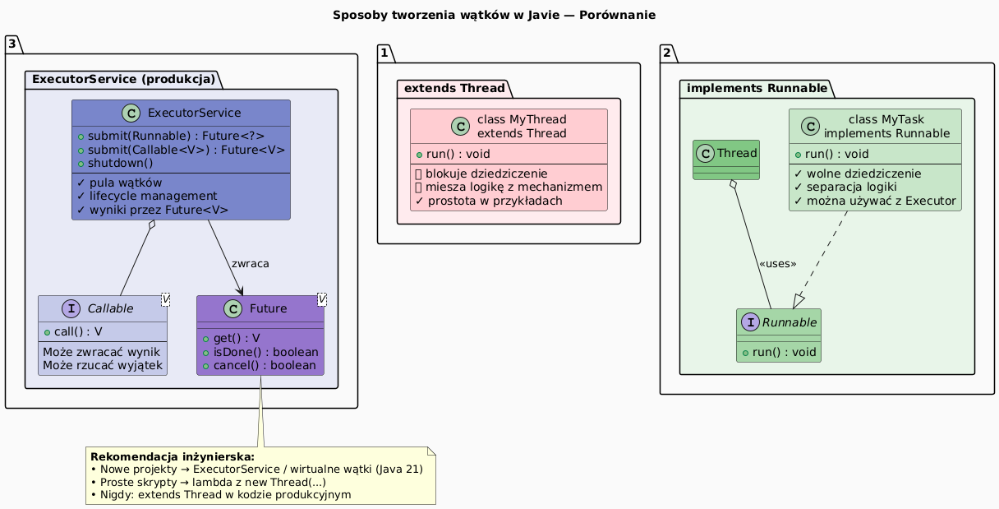

# 05 — Tworzenie wątku: Thread vs Runnable vs ExecutorService

## Cel modułu

Poznanie i porównanie trzech sposobów tworzenia wątków w Javie: dziedziczenie po `Thread`, implementacja `Runnable`, oraz nowoczesne `ExecutorService`. Wybór odpowiedniego podejścia z perspektywy inżynierii oprogramowania.

---

## 1. Diagram porównawczy



---

## 2. Sposób 1: `extends Thread`

```java
// Tworzenie wątku przez dziedziczenie
class CounterThread extends Thread {
    private final String label;
    private final int from, to;

    CounterThread(String label, int from, int to) {
        super("Thread-" + label);   // nazwa wątku
        this.label = label;
        this.from = from;
        this.to = to;
    }

    @Override
    public void run() {
        long sum = 0;
        for (int i = from; i < to; i++) sum += i;
        System.out.printf("[%s] suma = %d%n", label, sum);
    }
}

// Użycie:
CounterThread t = new CounterThread("A", 0, 1_000_000);
t.start();    // ← start(), nie run()! Wywołanie run() wprost to błąd.
t.join();
```

**Wady `extends Thread`:**
- Blokuje dziedziczenie po innej klasie (Java nie ma wielodziedziczenia)
- Miesza logikę zadania z mechanizmem uruchamiania
- Trudno przetestować (nie można przekazać mocka)

---

## 3. Sposób 2: `implements Runnable` — separacja logiki

```java
// Runnable: tylko logika zadania
class CounterRunnable implements Runnable {
    private final String label;
    private final int from, to;

    CounterRunnable(String label, int from, int to) { ... }

    @Override
    public void run() {
        long sum = 0;
        for (int i = from; i < to; i++) sum += i;
        System.out.printf("[%s] suma = %d%n", label, sum);
    }
}

// Użycie: logika oddzielona od wątku
Runnable task = new CounterRunnable("B", 0, 1_000_000);
Thread t = new Thread(task, "Thread-B");    // wstrzyknięcie zadania
t.start();

// Alternatywnie: lambda
Thread t2 = new Thread(() -> System.out.println("Lambda!"), "lambda-thread");
t2.start();
```

**Zalety `implements Runnable`:**
- Wolne dziedziczenie (klasa może dziedziczyć po dowolnej klasie)
- Separacja logiki od mechanizmu uruchamiania (SRP)
- Łatwy do testowania
- Można przekazać do `ExecutorService`

---

## 4. Sposób 3: `ExecutorService` — standard produkcyjny

```java
// ✓ Najczystsze podejście dla kodu produkcyjnego
ExecutorService executor = Executors.newFixedThreadPool(4); // 4 wątki w puli

// Zadanie bez wyniku (Runnable)
executor.submit(() -> System.out.println("Zadanie 1: " + Thread.currentThread().getName()));

// Zadanie z wynikiem (Callable<V>)
Future<Long> future = executor.submit(() -> {
    long sum = 0;
    for (int i = 0; i < 1_000_000; i++) sum += i;
    return sum;
});

// Odbiór wyniku (blokujący)
Long result = future.get();     // czeka aż zadanie skończy
System.out.println("Wynik: " + result);

// Ważne: zawsze zamknij executor
executor.shutdown();
```

### Typy pul wątków

```java
Executors.newFixedThreadPool(N);          // N wątków, kolejka nieograniczona
Executors.newCachedThreadPool();           // wątki tworzone na żądanie
Executors.newSingleThreadExecutor();       // 1 wątek, zadania kolejkowane
Executors.newScheduledThreadPool(N);       // harmonogramowane zadania
// Java 21:
Executors.newVirtualThreadPerTaskExecutor(); // wątki wirtualne (lekkie)
```

---

## 5. Wątki wirtualne (Java 21) — `Project Loom`

```java
// Java 21 — wątki wirtualne: miliony jednocześnie!
try (var executor = Executors.newVirtualThreadPerTaskExecutor()) {
    IntStream.range(0, 10_000).forEach(i ->
        executor.submit(() -> {
            Thread.sleep(100);   // wirtualny wątek "parkuje" nie blokując OS thread
            return i * i;
        })
    );
}
// 10_000 "wątków" — tylko kilka wątków platformowych!
```

---

## 6. Kiedy co wybrać?

| Podejście | Kiedy stosować |
|-----------|---------------|
| `extends Thread` | Nigdy w kodzie produkcyjnym; tylko proste ćwiczenia |
| `implements Runnable` | Gdy potrzeba jednego wątku z logiką; starszy kod |
| `ExecutorService` | Zawsze — zarządzanie pulą, lifecycle, wyniki przez `Future` |
| Wirtualne wątki | Java 21+, I/O bound tasks, tysiące równoległych zadań |

---

## 7. Kod demonstracyjny

📄 [`code/ThreadCreationDemo.java`](code/ThreadCreationDemo.java)

Sekcje:
- `part1_ExtendThread()` — dziedziczenie po `Thread`
- `part2_ImplementRunnable()` — implementacja `Runnable`
- `part3_LambdaAndExecutor()` — lambda i `ExecutorService`
- `part4_Comparison()` — porównanie wyników i czasu wykonania

### Uruchomienie

```powershell
cd C:\home\gitHub\oop-concepts-java\02_OOP\src
javac -d _07_watki/out _07_watki/_05_tworzenie_watku/code/ThreadCreationDemo.java
java  -cp _07_watki/out _07_watki._05_tworzenie_watku.code.ThreadCreationDemo
```

---

## 8. Pytania kontrolne

1. Dlaczego `t.run()` zamiast `t.start()` nie tworzy nowego wątku?
2. Jaką przewagę daje `Runnable` nad `extends Thread` z perspektywy OOP?
3. Co to jest `Future<V>` i jak uzyskać wynik asynchronicznego zadania?
4. Czym wątek wirtualny (Java 21) różni się od wątku platformowego?

---

## 📚 Literatura i źródła

- [Oracle API — Runnable](https://docs.oracle.com/en/java/javase/21/docs/api/java.base/java/lang/Runnable.html)
- [Oracle API — ExecutorService](https://docs.oracle.com/en/java/javase/21/docs/api/java.base/java/util/concurrent/ExecutorService.html)
- [JEP 444 — Virtual Threads (Java 21)](https://openjdk.org/jeps/444)
- Brian Goetz et al., *Java Concurrency in Practice*, rozdział 6 (Task Execution)

