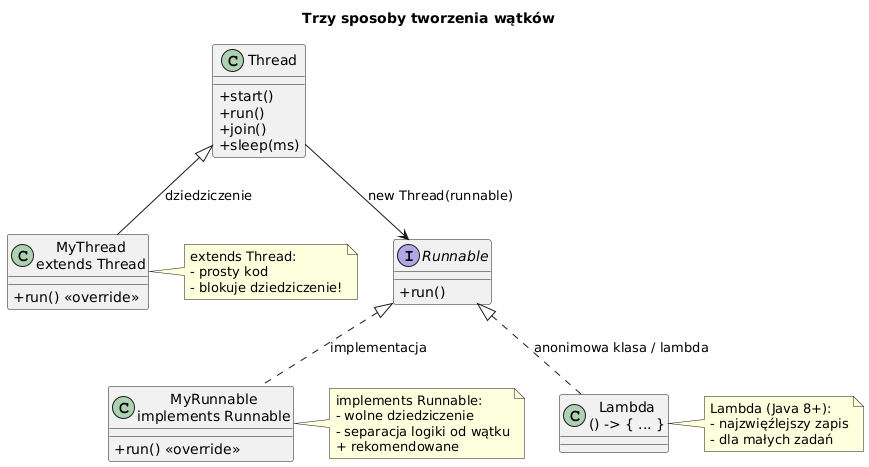

# _05_tworzenie_watku - Thread vs Runnable

## Cel
Porownac podejscia do tworzenia pracy rownoleglej: `extends Thread`, `implements Runnable`, `ExecutorService`.

## Wnioski inzynierskie
- `extends Thread` jest proste, ale blokuje dziedziczenie po innej klasie.
- `implements Runnable` lepiej separuje logike od mechanizmu uruchamiania.
- `ExecutorService` jest standardem produkcyjnym (zarzadzanie pula, lifecycle, kolejkowanie).

## Kod
Plik: `code/ThreadCreationDemo.java`

Sekcje:
- `part1_ExtendThread()`
- `part2_ImplementRunnable()`
- `part3_LambdaAndExecutor()`
- `part4_Comparison()`

Fragment:
```java
CounterRunnable r1 = new CounterRunnable("R1", 0, 1_000_000);
Thread t1 = new Thread(r1, "Thread-R1");
t1.start();
```

## Diagram


Zrodlo: `diagrams/thread_creation.puml`

## Uruchomienie
```powershell
cd C:\home\gitHub\oop-concepts-java\02_OOP\src
javac -d _07_watki/out _07_watki/_05_tworzenie_watku/code/ThreadCreationDemo.java
java -cp _07_watki/out _07_watki._05_tworzenie_watku.code.ThreadCreationDemo
```

## Literatura
- https://docs.oracle.com/en/java/javase/21/docs/api/java.base/java/lang/Runnable.html
- https://docs.oracle.com/en/java/javase/21/docs/api/java.base/java/util/concurrent/ExecutorService.html

