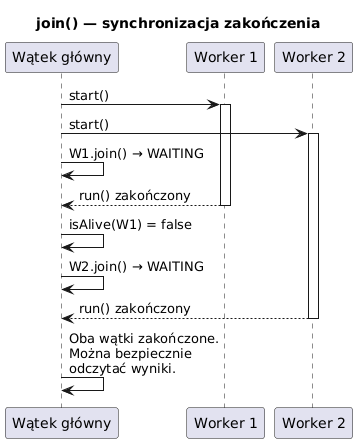

# _06_join_isalive - `isAlive()` i `join()`

## Cel
Nauczyc sie koordynacji watkow: sprawdzania stanu zycia watku i czekania na zakonczenie pracy.

## Pojecia
- `isAlive()` - czy watek zostal uruchomiony i jeszcze nie zakonczyl `run()`.
- `join()` - blokujacy wait na zakonczenie konkretnego watku.
- `join(timeout)` - oczekiwanie ograniczone czasowo.

## Kod
Plik: `code/JoinAliveDemo.java`

Sekcje:
- `part1_IsAlive()` - zmiana `isAlive` przed/po `start()` i po zakonczeniu.
- `part2_Join()` - czekanie na wiele watkow.
- `part3_JoinTimeout()` - timeout i reakcja przez `interrupt()`.
- `part4_FanOutFanIn()` - klasyczny wzorzec rownoleglego przetwarzania.

Fragment:
```java
slow.start();
slow.join(300);
if (slow.isAlive()) {
    slow.interrupt();
}
```

## Diagram


Zrodlo: `diagrams/join_flow.puml`

## Uruchomienie
```powershell
cd C:\home\gitHub\oop-concepts-java\02_OOP\src
javac -d _07_watki/out _07_watki/_06_join_isalive/code/JoinAliveDemo.java
java -cp _07_watki/out _07_watki._06_join_isalive.code.JoinAliveDemo
```

## Literatura
- https://docs.oracle.com/en/java/javase/21/docs/api/java.base/java/lang/Thread.html#join()

