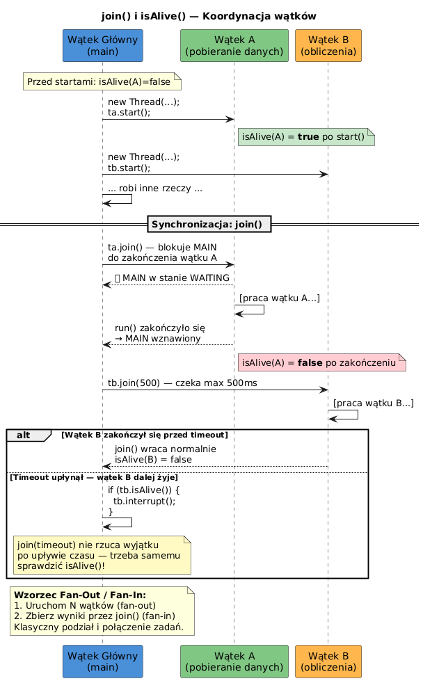

# 06 — `isAlive()` i `join()` — Koordynacja wątków

## Cel modułu

Opanowanie mechanizmów koordynacji cyklu życia wątków: sprawdzania czy wątek żyje (`isAlive()`) i oczekiwania na jego zakończenie (`join()`). Zastosowanie wzorca Fan-Out/Fan-In do równoległego przetwarzania.

---

## 1. `isAlive()` — kiedy wątek żyje?

```java
Thread t = new Thread(() -> {
    Thread.sleep(200);
    System.out.println("Zakończono");
});

System.out.println(t.isAlive());   // false — jeszcze nie uruchomiony

t.start();
System.out.println(t.isAlive());   // true  — działa

t.join();                          // czekamy na zakończenie
System.out.println(t.isAlive());   // false — zakończony
```

`isAlive()` zwraca `true` gdy wątek jest w jednym z stanów: `RUNNABLE`, `BLOCKED`, `WAITING`, `TIMED_WAITING`.

---

## 2. Diagram sekwencji join()



---

## 3. Diagram przepływu


---

## 4. `join()` — blokujące oczekiwanie na zakończenie

```java
Thread worker = new Thread(() -> {
    for (int i = 0; i < 5; i++) {
        System.out.println("Pracuję: " + i);
        Thread.sleep(100);
    }
});

worker.start();
System.out.println("Wątek główny czeka...");
worker.join();       // blokuje wątek główny do zakończenia worker
System.out.println("Worker zakończył — kontynuuję.");
// Gwarantowane że worker.run() w pełni zakończyło się
```

---

## 5. `join(timeout)` — oczekiwanie z limitem czasu

```java
Thread slowWorker = new Thread(() -> { Thread.sleep(5000); });
slowWorker.start();

slowWorker.join(1000);         // czekamy max 1 sekundę

if (slowWorker.isAlive()) {
    // Wątek nadal żyje po 1s — decydujemy co robić
    slowWorker.interrupt();    // opcjonalnie: przerywamy
    System.out.println("Timeout — przerywam wolny wątek");
} else {
    System.out.println("Worker skończył w czasie");
}
```

**Uwaga:** `join(timeout)` po upływie czasu **nie rzuca wyjątku** — sam musisz sprawdzić `isAlive()`.

---

## 6. Wzorzec Fan-Out / Fan-In

```java
// Fan-Out: uruchom N zadań równolegle
int N = 8;
Thread[] workers = new Thread[N];
long[] results   = new long[N];

for (int i = 0; i < N; i++) {
    final int idx = i;
    workers[i] = new Thread(() -> {
        results[idx] = heavyCompute(idx);  // zadanie równoległe
    });
    workers[i].start();                    // FAN-OUT
}

// Fan-In: zbierz wyniki
for (Thread w : workers) {
    w.join();                              // FAN-IN — czekamy na każdy
}

// Teraz wszystkie results[] są wypełnione
long total = Arrays.stream(results).sum();
System.out.println("Wynik: " + total);
```

---

## 7. Wiele join() — kolejność ma znaczenie

```java
// Jeśli A kończy się szybko, B wolno:
a.join();   // czeka max tyle ile A potrzebuje
b.join();   // potem czeka na B (lub nic, jeśli już skończyło)

// To NIE jest sekwencyjne — wątki działały równolegle!
// join() tylko SYNCHRONIZUJE punkt zbierania wyników
```

---

## 8. Kod demonstracyjny

📄 [`code/JoinAliveDemo.java`](code/JoinAliveDemo.java)

Sekcje:
- `part1_IsAlive()` — zmiana `isAlive` przed/po `start()` i po zakończeniu
- `part2_Join()` — czekanie na wiele wątków
- `part3_JoinTimeout()` — timeout i reakcja przez `interrupt()`
- `part4_FanOutFanIn()` — klasyczny wzorzec równoległego przetwarzania

### Uruchomienie

```powershell
cd C:\home\gitHub\oop-concepts-java\02_OOP\src
javac -d _07_watki/out _07_watki/_06_join_isalive/code/JoinAliveDemo.java
java  -cp _07_watki/out _07_watki._06_join_isalive.code.JoinAliveDemo
```

---

## 9. Pytania kontrolne

1. W których stanach `Thread.State` metoda `isAlive()` zwraca `true`?
2. Co się stanie jeśli wywołamy `join()` na wątku który jeszcze nie był `start()`-owany?
3. Jak `join(timeout)` różni się od `Thread.sleep(timeout)` z punktu widzenia semantyki?
4. Opisz wzorzec Fan-Out/Fan-In i podaj przykład zastosowania.

---

## 📚 Literatura i źródła

- [Oracle API — Thread.join()](https://docs.oracle.com/en/java/javase/21/docs/api/java.base/java/lang/Thread.html#join())
- [Oracle API — Thread.isAlive()](https://docs.oracle.com/en/java/javase/21/docs/api/java.base/java/lang/Thread.html#isAlive())
- Brian Goetz et al., *Java Concurrency in Practice*, rozdział 5 (Building Blocks)

