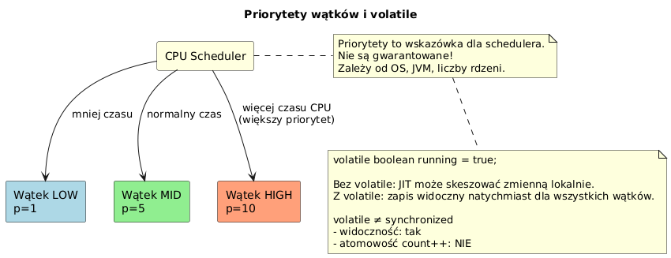

# _07_priorytety_volatile - Priorytety i `volatile`

## Cel
Pokazac praktyczne skutki priorytetow oraz znaczenie `volatile` dla widocznosci zmian miedzy watkami.

## Teoria
- Priorytet (`1..10`) to sugestia dla schedulera OS/JVM, nie twarda gwarancja.
- `volatile` daje gwarancje widocznosci odczytow/zapisow, ale nie atomowosci operacji zlozonych.
- `count++` pozostaje nieatomowe nawet przy `volatile`.

## Kod
Plik: `code/PriorityVolatileDemo.java`

Sekcje:
- `part1_PriorityComparison()` - porownanie `MIN/NORM/MAX`.
- `part2_Volatile()` - flaga stop sterowana przez `volatile`.
- `part3_VolatileNotEnough()` - `volatile` vs `AtomicInteger`.

Fragment:
```java
volatile int count = 0;
void increment() { count++; } // nieatomowe
```

## Diagram


Zrodlo: `diagrams/priority_volatile.puml`

## Uruchomienie
```powershell
cd C:\home\gitHub\oop-concepts-java\02_OOP\src
javac -d _07_watki/out _07_watki/_07_priorytety_volatile/code/PriorityVolatileDemo.java
java -cp _07_watki/out _07_watki._07_priorytety_volatile.code.PriorityVolatileDemo
```

## Literatura
- https://docs.oracle.com/javase/specs/jls/se21/html/jls-17.html
- https://docs.oracle.com/en/java/javase/21/docs/api/java.base/java/util/concurrent/atomic/AtomicInteger.html

