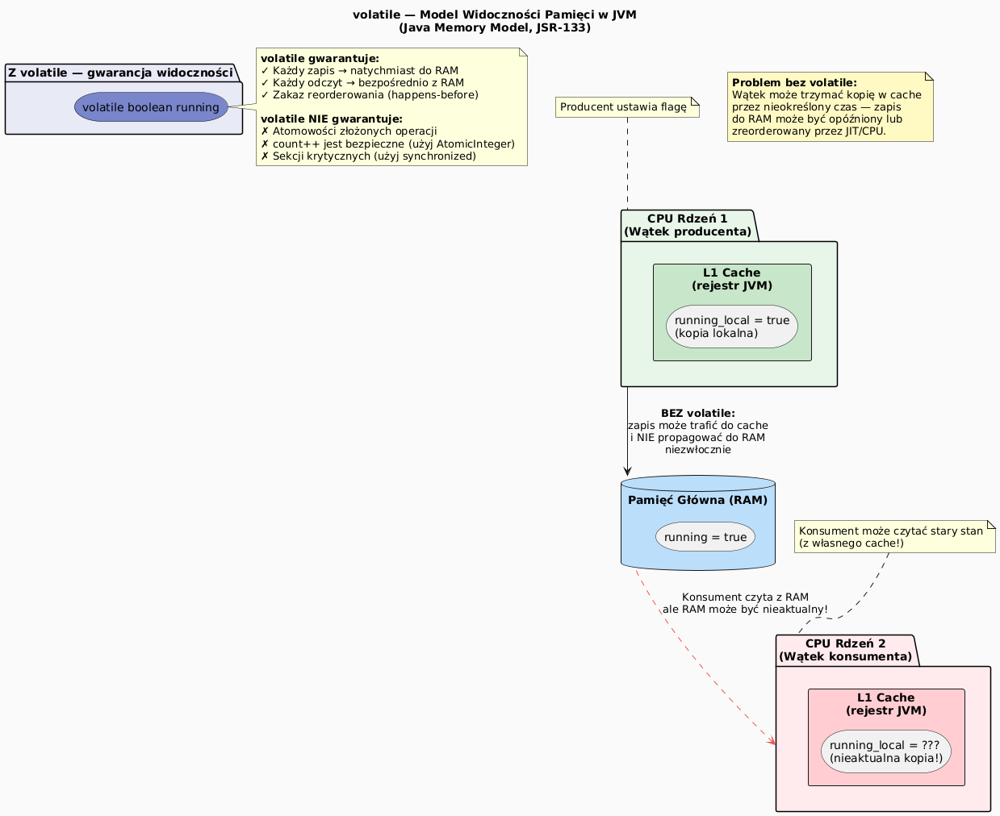

# 07 — Priorytety wątków i `volatile`

## Cel modułu

Zrozumienie wpływu priorytetów wątków na scheduling oraz znaczenia słowa kluczowego `volatile` dla widoczności zmian między wątkami w kontekście Java Memory Model.

---

## 1. Priorytety wątków

### Jak działają priorytety?

```java
Thread t = new Thread(() -> { /* ... */ });
t.setPriority(Thread.MIN_PRIORITY);    // 1
t.setPriority(Thread.NORM_PRIORITY);   // 5 (domyślny)
t.setPriority(Thread.MAX_PRIORITY);    // 10
```

Priorytety to **sugestia** dla schedulera JVM/OS. Wątek o wyższym priorytecie powinien dostawać więcej czasu CPU, ale:
- Scheduler OS może ignorować priorytety JVM
- Na Linuxie NORM (5) = systemowy priorytet 0 — wszystko tak samo
- Na Windowsie priorytety są respektowane bardziej
- Nigdy nie polegaj na priorytetach jako mechanizmie synchronizacji!

```java
// Obserwacja różnic priorytetów
Thread low  = new Thread(counter, "LOW");
Thread high = new Thread(counter, "HIGH");
low.setPriority(Thread.MIN_PRIORITY);   // 1
high.setPriority(Thread.MAX_PRIORITY);  // 10
// high może policzyć kilkukrotnie więcej — ale to zależy od OS
```

---

## 2. `volatile` — widoczność pamięci

### Problem: cache CPU ukrywa zmiany



Nowoczesne procesory mają **hierarchię pamięci podręcznej** (L1/L2/L3 cache). JVM może trzymać zmienne w rejestrach lub cache rdzenia. Bez specjalnych gwarancji:

```java
// ❌ Wątek konsumenta może nigdy nie zobaczyć zmiany!
boolean running = true;    // bez volatile

// Wątek producenta:
running = false;           // zapis może trafić do cache, nie do RAM

// Wątek konsumenta:
while (running) { ... }   // czyta z własnego cache — może widzieć true na zawsze!
```

---

## 3. `volatile` — gwarancje

```java
// ✓ volatile gwarantuje widoczność
volatile boolean running = true;

// Wątek producenta:
running = false;    // natychmiast do pamięci głównej (RAM)

// Wątek konsumenta:
while (running) { ... }   // zawsze z RAM — widzi aktualną wartość
```

**Co gwarantuje `volatile`:**
1. Każdy zapis natychmiast trafia do pamięci głównej
2. Każdy odczyt pochodzi z pamięci głównej (nie z cache)
3. Zakaz reorderowania (happens-before) przez JIT i CPU

**Czego `volatile` NIE gwarantuje:**
```java
volatile int count = 0;

// ❌ count++ NIE jest atomowe nawet z volatile!
void increment() { count++; }
// To nadal: READ count → INC → WRITE count (trzy kroki)
// Dwa wątki mogą oba odczytać 0, oba zapisać 1 → utracona aktualizacja

// ✓ Do tego potrzebny AtomicInteger lub synchronized
AtomicInteger atomicCount = new AtomicInteger(0);
void increment() { atomicCount.incrementAndGet(); }
```

---

## 4. Kiedy używać `volatile`?

| Scenariusz | `volatile` | `AtomicInteger` | `synchronized` |
|-----------|-----------|----------------|---------------|
| Flaga stop/start | ✓ | — | — |
| Jeden writer, wielu readerów | ✓ (proste typy) | — | — |
| Licznik z inkrementacją | ❌ | ✓ | ✓ |
| Zbiór operacji atomowych | ❌ | ❌ | ✓ |

```java
// ✓ Idealny przypadek volatile: flaga sterująca
class Worker implements Runnable {
    private volatile boolean stopped = false;

    public void stop() { stopped = true; }    // wątek zewnętrzny

    @Override
    public void run() {
        while (!stopped) {                    // wątek roboczy
            doWork();
        }
        System.out.println("Zatrzymano.");
    }
}
```

---

## 5. Kod demonstracyjny

📄 [`code/PriorityVolatileDemo.java`](code/PriorityVolatileDemo.java)

Sekcje:
- `part1_PriorityComparison()` — porównanie MIN/NORM/MAX przez czas
- `part2_Volatile()` — flaga `stop` sterowana przez `volatile`
- `part3_VolatileNotEnough()` — demonstracja że `volatile` nie wystarcza do `count++`

### Uruchomienie

```powershell
cd C:\home\gitHub\oop-concepts-java\02_OOP\src
javac -d _07_watki/out _07_watki/_07_priorytety_volatile/code/PriorityVolatileDemo.java
java  -cp _07_watki/out _07_watki._07_priorytety_volatile.code.PriorityVolatileDemo
```

---

## 6. Pytania kontrolne

1. Dlaczego priorytety wątków w Javie są tylko "sugestią"?
2. Jaka jest różnica w gwarancjach między `volatile` a `synchronized`?
3. Dlaczego `volatile int count; count++` jest nadal niebezpieczne wielowątkowo?
4. Co to jest "happens-before" w Java Memory Model?

---

## 📚 Literatura i źródła

- [Java Language Specification §17.4 — Memory Model](https://docs.oracle.com/javase/specs/jls/se21/html/jls-17.html)
- Brian Goetz et al., *Java Concurrency in Practice*, rozdział 3 (Sharing Objects)
- [Oracle API — AtomicInteger](https://docs.oracle.com/en/java/javase/21/docs/api/java.base/java/util/concurrent/atomic/AtomicInteger.html)
- [JSR-133 — Java Memory Model](https://jcp.org/en/jsr/detail?id=133)

