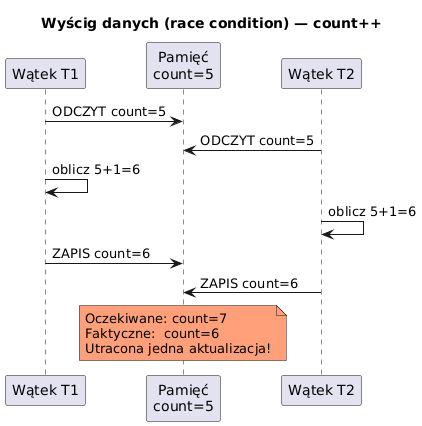

# _08_synchronizacja - Sekcja krytyczna i `synchronized`

## Cel
Wyjasnic, dlaczego sekcje krytyczne wymagaja ochrony i jak `synchronized` eliminuje race condition.

## Kontekst
Sekcja krytyczna to fragment kodu operujacy na wspolnym stanie. Bez mechanizmu wzajemnego wykluczania (`mutex/monitor`) dostajemy utracone aktualizacje.

## Kod
Plik: `code/SynchronizationDemo.java`

Sekcje:
- `part1_RaceCondition()` - licznik bez synchronizacji.
- `part2_Synchronized()` - licznik z `synchronized`.
- `part3_BankAccount()` - scenariusz domenowy konto/wplata/wyplata.
- `part4_Atomic()` - alternatywa lock-free (`AtomicInteger`).

Fragment:
```java
synchronized void increment() { count++; }
```

## Diagram


Zrodlo: `diagrams/race_condition.puml`

## Uruchomienie
```powershell
cd C:\home\gitHub\oop-concepts-java\02_OOP\src
javac -d _07_watki/out _07_watki/_08_synchronizacja/code/SynchronizationDemo.java
java -cp _07_watki/out _07_watki._08_synchronizacja.code.SynchronizationDemo
```

## Literatura
- https://docs.oracle.com/javase/tutorial/essential/concurrency/locksync.html

