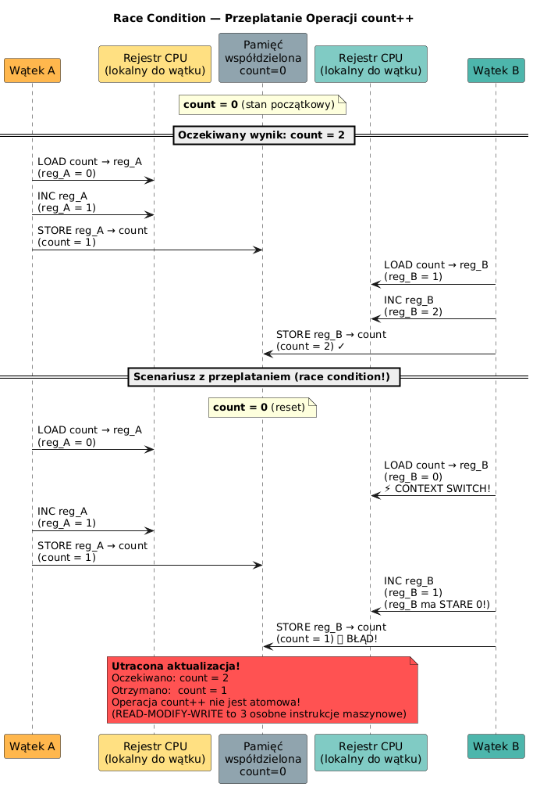

# 08 — Sekcja krytyczna i Race Condition

## Cel modułu

Zrozumienie mechanizmu wyścigu (race condition) na poziomie instrukcji maszynowych oraz zastosowanie `synchronized` i `AtomicInteger` jako narzędzi gwarantujących poprawność operacji wielowątkowych.

---

## 1. Race Condition — co to jest?

**Race condition** (wyścig wątków) to sytuacja, w której poprawność wyniku programu zależy od kolejności, w jakiej wątki uzyskują dostęp do wspólnych danych. Ta kolejność jest **nieprzewidywalna** — zależy od schedulera OS.

---

## 2. Diagram: przeplatanie operacji count++



Operacja `count++` w języku Java to **trzy oddzielne instrukcje maszynowe**:

```
LOAD  count → rejestr   // odczyt z pamięci
INC   rejestr           // inkrementacja
STORE rejestr → count   // zapis z powrotem
```

Jeśli między LOAD a STORE nastąpi **context switch** (przełączenie wątków), wątek A i wątek B odczytają tę samą wartość, każdy zainkrementuje swoją lokalną kopię i nadpiszą wzajemnie swoje wyniki.

---

## 3. Diagram poglądowy (race condition)


---

## 4. Demonstracja problemu

```java
// 10 wątków po 100_000 inkrementacji = oczekiwane 1_000_000
static int count = 0;   // WSPÓŁDZIELONY bez synchronizacji

Thread[] threads = new Thread[10];
for (int i = 0; i < 10; i++) {
    threads[i] = new Thread(() -> {
        for (int j = 0; j < 100_000; j++) {
            count++;          // ❌ RACE CONDITION — wynik < 1_000_000
        }
    });
    threads[i].start();
}

// Wynik: np. 743_892 zamiast 1_000_000 — utracone aktualizacje!
```

---

## 5. Rozwiązanie 1: `synchronized`

```java
// ✓ Jeden wątek naraz — gwarantuje atomowość READ-MODIFY-WRITE
static int count = 0;
static final Object LOCK = new Object();

void increment() {
    synchronized (LOCK) {
        count++;           // całe READ-MODIFY-WRITE pod lockiem
    }
}

// Lub: synchronized method (lock na this)
synchronized void increment() { count++; }
```

---

## 6. Rozwiązanie 2: `AtomicInteger` (lock-free)

```java
// ✓ Operacja atomowa na poziomie sprzętowym (CAS — Compare-And-Swap)
static AtomicInteger count = new AtomicInteger(0);

void increment() {
    count.incrementAndGet();   // atomowe, bez locka, szybsze przy małej rywalizacji
}

// Inne przydatne operacje:
count.getAndAdd(5);           // atomowe dodanie 5, zwraca starą wartość
count.compareAndSet(10, 20);  // jeśli wartość == 10, ustaw na 20 (atomowo)
```

**CAS (Compare-And-Swap):** operacja sprzętowa — procesor atomowo porównuje wartość pamięci z oczekiwaną i zapisuje nową tylko jeśli się zgadzają. Brak blokady → mniejszy koszt przy niskiej rywalizacji.

---

## 7. Scenariusz domenowy: konto bankowe

```java
class BankAccount {
    private int balance;

    // ❌ Niesynchronizowane — utrata pieniędzy!
    void unsafeDeposit(int amount) { balance += amount; }

    // ✓ Synchronizowane — gwarantuje poprawność
    synchronized void deposit(int amount) {
        balance += amount;
    }

    // ✓ Sprawdź-i-działaj atomowo
    synchronized boolean withdraw(int amount) {
        if (balance >= amount) {    // sprawdź + działaj = atomowo
            balance -= amount;
            return true;
        }
        return false;
    }
}
```

---

## 8. Kod demonstracyjny

📄 [`code/SynchronizationDemo.java`](code/SynchronizationDemo.java)

Sekcje:
- `part1_RaceCondition()` — licznik bez synchronizacji (demonstruje błąd)
- `part2_Synchronized()` — licznik z `synchronized` (wynik poprawny)
- `part3_BankAccount()` — scenariusz domenowy konto/wpłata/wypłata
- `part4_Atomic()` — alternatywa lock-free z `AtomicInteger`

### Uruchomienie

```powershell
cd C:\home\gitHub\oop-concepts-java\02_OOP\src
javac -d _07_watki/out _07_watki/_08_synchronizacja/code/SynchronizationDemo.java
java  -cp _07_watki/out _07_watki._08_synchronizacja.code.SynchronizationDemo
```

---

## 9. Porównanie rozwiązań

| Metoda | Bezpieczeństwo | Wydajność (niski contention) | Wydajność (wysoki contention) |
|--------|---------------|------------------------------|-------------------------------|
| Brak sync | ❌ | Najszybsza | Najszybsza (ale błędna!) |
| `synchronized` | ✓ | Umiarkowana | Dobra (OS optymalizuje) |
| `AtomicInteger` | ✓ | Szybsza niż sync | Może być gorsza (CAS retry) |

---

## 10. Pytania kontrolne

1. Dlaczego `count++` nie jest bezpieczne wielowątkowo nawet gdy zmienna jest `volatile`?
2. Co to jest CAS (Compare-And-Swap) i jak `AtomicInteger` go używa?
3. Co to jest "utracona aktualizacja" (lost update)?
4. Kiedy `AtomicInteger` jest lepszym wyborem od `synchronized`?

---

## 📚 Literatura i źródła

- [Oracle Tutorial — Synchronization](https://docs.oracle.com/javase/tutorial/essential/concurrency/locksync.html)
- Brian Goetz et al., *Java Concurrency in Practice*, rozdział 2 i 15
- [Java Language Specification §17 — Threads and Locks](https://docs.oracle.com/javase/specs/jls/se21/html/jls-17.html)

