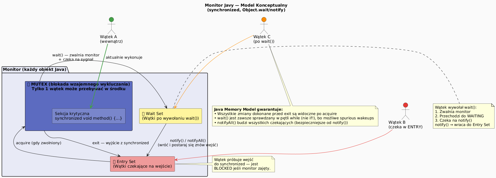

# 09 — Komenda `synchronized` — Warianty i granularność

## Cel modułu

Opanowanie wszystkich form słowa kluczowego `synchronized`: metoda instancyjna, metoda statyczna, blok synchronizowany. Zrozumienie pojęcia **monitora** i jak granularność locka wpływa na wydajność i poprawność.

---

## 1. Monitor — model konceptualny



Każdy obiekt w Javie ma **wbudowany monitor** (intrinsic lock / mutex). Monitor składa się z:
- **Sekcji krytycznej** — tylko 1 wątek na raz
- **Entry Set** — wątki czekające na wejście (stan `BLOCKED`)
- **Wait Set** — wątki po wywołaniu `wait()` (stan `WAITING`)

---

## 2. Diagram monitora


---

## 3. Cztery warianty `synchronized`

### Wariant 1: Metoda instancyjna — lock na `this`

```java
class Counter {
    private int count = 0;

    public synchronized void increment() { count++; }
    public synchronized int get() { return count; }
    // Lock: this (obiekt Counter)
    // Gwarancja: tylko 1 wątek naraz w dowolnej synchronized metodzie tego obiektu
}
```

### Wariant 2: Blok synchronizowany — lock na dowolnym obiekcie

```java
class DoubleCounter {
    private final Object lockA = new Object();
    private final Object lockB = new Object();
    private int a = 0, b = 0;

    void incA() {
        synchronized (lockA) { a++; }    // Lock tylko na lockA
    }
    void incB() {
        synchronized (lockB) { b++; }    // Lock tylko na lockB — nie koliduje z incA!
    }
    // Wątek 1 może incA() jednocześnie z wątkiem 2 robiącym incB()
}
```

### Wariant 3: Metoda statyczna — lock na `Class`

```java
class Registry {
    private static int instanceCount = 0;

    public static synchronized void register() {
        instanceCount++;
        // Lock: Registry.class (obiekt klasy, nie instancji)
    }
}
```

### Wariant 4: `synchronized(this)` vs zewnętrzny lock

```java
// ❌ synchronized(this) — narażone na "lock theft" z zewnątrz
public void method() {
    synchronized (this) { /* ... */ }
}
// Ktoś z zewnątrz może: synchronized(myObj) { ... } i zablokować naszą metodę

// ✓ Prywatny lock — kapsułkowanie locka
private final Object LOCK = new Object();
public void method() {
    synchronized (LOCK) { /* ... */ }   // Lock niedostępny z zewnątrz
}
```

---

## 4. Granularność locka — wydajność vs bezpieczeństwo

```java
// ❌ Jeden globalny lock — bezpieczne ale wolne
synchronized void transfer(Account from, Account to, int amount) {
    // Blokuje WSZYSTKIE operacje na WSZYSTKICH kontach
    from.debit(amount);
    to.credit(amount);
}

// ✓ Lock na poziomie konta — wyższy paralelizm
void transfer(Account from, Account to, int amount) {
    Account first  = from.id < to.id ? from : to;   // stały porządek!
    Account second = from.id < to.id ? to : from;
    synchronized (first) {                           // lock na koncie 1
        synchronized (second) {                      // lock na koncie 2
            first.debit(amount);
            second.credit(amount);
        }
    }
}
```

**Uwaga:** Przy lock-levelu niższym niż globalny — zawsze dbaj o stały porządek nabywania locków (unikasz deadlock).

---

## 5. Reentrancja (Reentrant lock)

```java
// synchronized w Javie jest reentrancki — ten sam wątek może wejść ponownie
class Node {
    synchronized void methodA() {
        methodB();   // ✓ ten sam wątek wchodzi do synchronized ponownie
    }
    synchronized void methodB() {
        // Działa — bo synchronized(this) i wątek już ma ten lock
        System.out.println("B");
    }
}
```

Gdyby lock był niereentrancki, `methodA()` zakleszczyłaby się sama na sobie.

---

## 6. Kod demonstracyjny

📄 [`code/SynchronizedBlockDemo.java`](code/SynchronizedBlockDemo.java)

Sekcje:
- `part1_MethodVsNoSync()` — porównanie metod z i bez synchronizacji
- `part2_SynchronizedBlock()` — blok synchronizowany z zewnętrznym monitorem
- `part3_StaticSync()` — synchronizacja na poziomie klasy
- `part4_LockGranularity()` — drobnoziarniste locki vs globalny

### Uruchomienie

```powershell
cd C:\home\gitHub\oop-concepts-java\02_OOP\src
javac -d _07_watki/out _07_watki/_09_synchronized/code/SynchronizedBlockDemo.java
java  -cp _07_watki/out _07_watki._09_synchronized.code.SynchronizedBlockDemo
```

---

## 7. Pytania kontrolne

1. Jaki obiekt jest lockiem przy `synchronized` na metodzie statycznej vs instancyjnej?
2. Czym jest reentrancja locka i dlaczego Java ją gwarantuje?
3. Dlaczego drobnoziarniste locki mogą być bardziej wydajne? Jakie ryzyko wprowadzają?
4. Jaka jest różnica między `synchronized(this)` a prywatnym obiektem locka?

---

## 📚 Literatura i źródła

- [Oracle Tutorial — Synchronized Methods](https://docs.oracle.com/javase/tutorial/essential/concurrency/syncmeth.html)
- Brian Goetz et al., *Java Concurrency in Practice*, rozdział 2 (Thread Safety) i 4 (Composing Objects)
- [Java Language Specification §17.1 — Synchronization](https://docs.oracle.com/javase/specs/jls/se21/html/jls-17.html)

