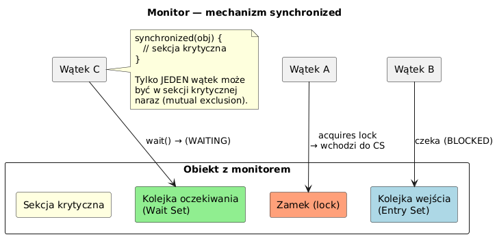

# _09_synchronized - Komenda `synchronized`

## Cel
Pokazac warianty uzycia `synchronized`: metoda instancyjna, blok, metoda statyczna i granularnosc zamkow.

## Co obejmuje temat
- `synchronized` na metodzie instancyjnej (lock na `this`).
- `synchronized(obj)` na dowolnym monitorze.
- `static synchronized` (lock na obiekcie klasy).
- Drobnoziarniste locki (`lockA`, `lockB`) vs jeden globalny lock.

## Kod
Plik: `code/SynchronizedBlockDemo.java`

Sekcje:
- `part1_MethodVsNoSync()`
- `part2_SynchronizedBlock()`
- `part3_StaticSync()`
- `part4_LockGranularity()`

Fragment:
```java
synchronized (target) {
    target.print(b1, word, b2);
}
```

## Diagram


Zrodlo: `diagrams/synchronized_monitor.puml`

## Uruchomienie
```powershell
cd C:\home\gitHub\oop-concepts-java\02_OOP\src
javac -d _07_watki/out _07_watki/_09_synchronized/code/SynchronizedBlockDemo.java
java -cp _07_watki/out _07_watki._09_synchronized.code.SynchronizedBlockDemo
```

## Literatura
- https://docs.oracle.com/javase/tutorial/essential/concurrency/syncmeth.html

