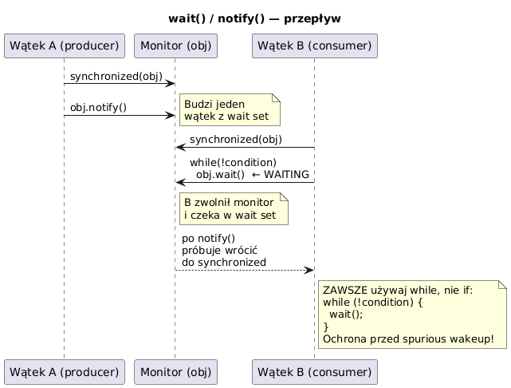

# _10_wait_notify - Komunikacja watkow

## Cel
Zrozumiec wspolprace watkow przez monitor i metody `wait()`, `notify()`, `notifyAll()`.

## Dlaczego to powstalo
Sama synchronizacja (`synchronized`) chroni przed jednoczesnym dostepem, ale nie rozwiazuje problemu warunku logicznego typu "poczekaj az pojawi sie dane". Do tego sluzy protokol wait/notify.

## Zasady bezpieczenstwa
- `wait/notify/notifyAll` wolno wywolywac tylko wewnatrz `synchronized` na tym samym obiekcie.
- Warunek sprawdzamy zawsze petla `while`, nigdy samym `if`.
- `notifyAll` jest bezpieczniejsze, gdy wiele watkow czeka z roznymi warunkami.

## Kod
Plik: `code/WaitNotifyDemo.java`

Sekcje:
- `part1_SimpleSignal()` - sygnal gotowosci.
- `part2_NotifyAll()` - odblokowanie wielu czekajacych.
- `part3_BoundedQueue()` - kolejka ograniczona pojemnoscia.

Fragment:
```java
synchronized void awaitReady() throws InterruptedException {
    while (!ready) {
        wait();
    }
}
```

## Diagram


Zrodlo: `diagrams/wait_notify_flow.puml`

## Uruchomienie
```powershell
cd C:\home\gitHub\oop-concepts-java\02_OOP\src
javac -d _07_watki/out _07_watki/_10_wait_notify/code/WaitNotifyDemo.java
java -cp _07_watki/out _07_watki._10_wait_notify.code.WaitNotifyDemo
```

## Literatura
- https://docs.oracle.com/javase/tutorial/essential/concurrency/guardmeth.html

