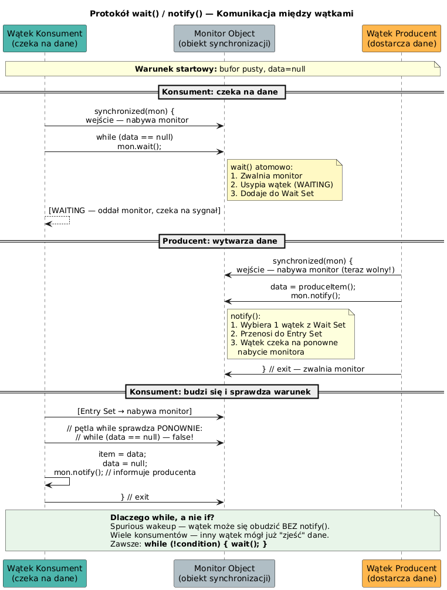

# 10 — Komunikacja wątków: wait(), notify(), notifyAll()

## Cel modułu

Zrozumienie mechanizmu komunikacji między wątkami przez monitor Javy. Opanowanie protokołu `wait/notify` jako sposobu na koordynację wątków zależnych od warunków logicznych.

---

## 1. Problem: Synchronizacja na warunek

`synchronized` chroni przed jednoczesnym dostępem, ale nie rozwiązuje problemu warunku logicznego: **"poczekaj aż dane będą dostępne"**. Do tego służy protokół `wait/notify`.

```java
// ❌ Aktywne oczekiwanie — marnuje CPU
synchronized (monitor) {
    while (!ready) {
        // nic nie robimy, ale blokujemy monitor!
    }
    use(data);
}

// ✓ Pasywne oczekiwanie przez wait()
synchronized (monitor) {
    while (!ready) {
        monitor.wait();    // zwalnia monitor i usypia wątek
    }
    use(data);
}
```

---

## 2. Diagram protokołu wait/notify



---

## 3. Diagram przepływu


---

## 4. Jak działa `wait()` — mechanika

Wywołanie `wait()` wykonuje trzy kroki **atomowo**:
1. Zwalnia monitor (wychodzi z `synchronized`)
2. Dodaje wątek do **Wait Set** monitora
3. Usypia wątek (stan `WAITING`)

Po obudzeniu przez `notify()`:
1. Wątek przechodzi z Wait Set do **Entry Set**
2. Czeka na ponowne nabycie monitora
3. Po nabyciu kontynuuje od miejsca `wait()`

```java
// ✓ Poprawny schemat
synchronized (obj) {
    while (!warunek) {    // ZAWSZE while, nigdy if!
        obj.wait();       // zwalnia lock, czeka
    }
    // warunek jest spełniony
    doWork();
}
```

---

## 5. `notify()` vs `notifyAll()`

| Metoda | Co robi | Kiedy używać |
|--------|---------|-------------|
| `notify()` | Budzi **jeden** losowy wątek z Wait Set | Gdy wszystkie czekające wątki czekają na ten sam warunek |
| `notifyAll()` | Budzi **wszystkie** wątki z Wait Set | Gdy wątki mogą czekać na różne warunki |

```java
// Scenariusz: jeden producent, wielu konsumentów
// notify() może obudzić drugiego konsumenta (który i tak wróci do wait())
// notifyAll() budzi wszystkich — każdy sprawdza swój warunek

synchronized (monitor) {
    data = produce();
    ready = true;
    monitor.notifyAll();   // bezpieczniejsze
}
```

---

## 6. Reguły bezpieczeństwa

```java
// REGUŁA 1: wait/notify tylko wewnątrz synchronized na TYM SAMYM obiekcie
Object mon = new Object();
synchronized (mon) {
    mon.wait();        // ✓
}
mon.wait();            // ❌ IllegalMonitorStateException

// REGUŁA 2: sprawdzaj warunek w pętli while (spurious wakeup!)
while (!condition) {
    monitor.wait();    // ✓
}

if (!condition) {
    monitor.wait();    // ❌ podatne na spurious wakeup i race condition
}

// REGUŁA 3: zawsze notifyAll() gdy nie masz pewności który wątek ma się obudzić
monitor.notifyAll();   // ✓ bezpieczniejsze niż notify()
```

---

## 7. Kolejka ograniczona pojemnością

```java
class BoundedQueue<T> {
    private final Queue<T> queue = new LinkedList<>();
    private final int capacity;

    BoundedQueue(int cap) { this.capacity = cap; }

    synchronized void put(T item) throws InterruptedException {
        while (queue.size() == capacity) {
            wait();        // czekaj jeśli pełna
        }
        queue.add(item);
        notifyAll();       // powiadom czekających odbiorców
    }

    synchronized T take() throws InterruptedException {
        while (queue.isEmpty()) {
            wait();        // czekaj jeśli pusta
        }
        T item = queue.poll();
        notifyAll();       // powiadom czekających nadawców
        return item;
    }
}
```

---

## 8. Kod demonstracyjny

📄 [`code/WaitNotifyDemo.java`](code/WaitNotifyDemo.java)

Sekcje:
- `part1_SimpleSignal()` — sygnał gotowości (ready flag)
- `part2_NotifyAll()` — odblokowanie wielu czekających
- `part3_BoundedQueue()` — kolejka ograniczona pojemnością

### Uruchomienie

```powershell
cd C:\home\gitHub\oop-concepts-java\02_OOP\src
javac -d _07_watki/out _07_watki/_10_wait_notify/code/WaitNotifyDemo.java
java  -cp _07_watki/out _07_watki._10_wait_notify.code.WaitNotifyDemo
```

---

## 9. Pytania kontrolne

1. Co robi `wait()` z monitorem obiektu? Opisz trzy kroki atomowo.
2. Dlaczego warunek sprawdzamy w `while`, a nie `if`?
3. W jakich sytuacjach `notify()` jest wystarczające, a kiedy trzeba użyć `notifyAll()`?
4. Co to jest spurious wakeup?

---

## 📚 Literatura i źródła

- [Oracle Tutorial — Guarded Blocks](https://docs.oracle.com/javase/tutorial/essential/concurrency/guardmeth.html)
- Brian Goetz et al., *Java Concurrency in Practice*, rozdział 14
- [Java Language Specification §17.2 — Wait sets and notification](https://docs.oracle.com/javase/specs/jls/se21/html/jls-17.html)

