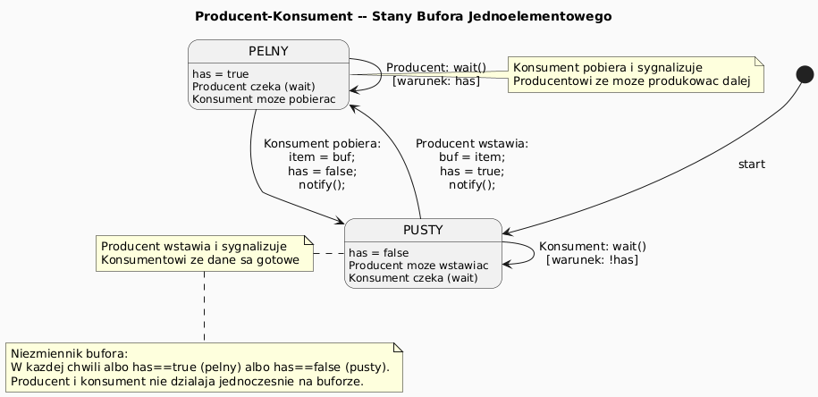
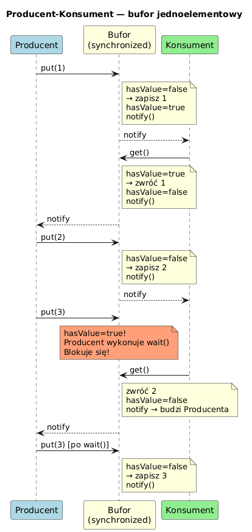

# 11 — Producent–Konsument (Producer–Consumer)

## Cel modułu

Opanowanie klasycznego wzorca synchronizacji: bufor współdzielony przez wątek produkujący dane i wątek odbierający dane. Zrozumienie, dlaczego `synchronized` to za mało i jak protokół `wait/notify` rozwiązuje problem warunku logicznego.

---

## 1. Geneza i znaczenie problemu

Problem Producent–Konsument opisał **Edsger W. Dijkstra** w 1965 roku. Jest on fundamentem wielu systemów:
- Kolejki zadań (job queues) w serwerach aplikacyjnych
- Strumienie danych (TCP bufory, java.io PipedStream)
- `BlockingQueue` w `java.util.concurrent`
- Potoki (UNIX pipes)
- Kolejki wiadomości (Kafka, RabbitMQ)

---

## 2. Model buforowany — diagram stanów



Bufor jednoelementowy ma dwa stany: **PUSTY** i **PEŁNY**:
- Producent może wstawiać tylko gdy bufor jest **pusty**
- Konsument może pobierać tylko gdy bufor jest **pełny**
- Każda strona po wykonaniu operacji sygnalizuje drugiej (`notify`)

---

## 3. Diagram sekwencji komunikacji



---

## 4. Błędna implementacja — tylko `synchronized`

```java
// ❌ BEZ wait/notify — aktywne oczekiwanie (busy-waiting) lub utracone dane
boolean[] has = {false};
Object[] buf = {null};

// Producent:
synchronized (monitor) {
    buf[0] = produce();
    has[0] = true;
    // Co jeśli konsument nie zdążył jeszcze odebrać? Nadpisujemy dane!
}

// Konsument:
synchronized (monitor) {
    if (has[0]) {           // ← jeśli nie ma — po prostu pomija (traci dane!)
        use(buf[0]);
        has[0] = false;
    }
}
```

**Problemy:**
- Producent może nadpisać dane, zanim konsument je odbierze
- Konsument może "nie trafić" na dane (brak koordynacji)
- Aktywne oczekiwanie (`while(true)`) marnuje CPU

---

## 5. Poprawna implementacja z `wait/notify`

```java
// ✓ Poprawna wersja — bufor jednoelementowy
synchronized (monitor) {
    // PRODUCENT: poczekaj jeśli bufor pełny
    while (has[0]) {
        monitor.wait();         // zwalnia monitor i czeka
    }
    buf[0] = item;
    has[0] = true;
    monitor.notify();           // budzi konsumenta
}

synchronized (monitor) {
    // KONSUMENT: poczekaj jeśli bufor pusty
    while (!has[0]) {
        monitor.wait();         // zwalnia monitor i czeka
    }
    Object item = buf[0];
    has[0] = false;
    monitor.notify();           // budzi producenta
}
```

**Dlaczego `while`, nie `if`?**
- **Spurious wakeup** — wątek może się obudzić bez `notify()` (specyfika JVM/OS)
- **Wiele konsumentów** — po `notifyAll()` inny konsument mógł już "zjeść" dane
- Reguła: **zawsze sprawdzaj warunek w pętli `while` po przebudzeniu**

---

## 6. Modernizacja: BlockingQueue (Java 5+)

```java
// ✓ Najczystsza wersja produkcyjna — BlockingQueue
BlockingQueue<Integer> queue = new ArrayBlockingQueue<>(10); // bufor 10 elementów

// Producent:
Thread producer = new Thread(() -> {
    for (int i = 0; i < 100; i++) {
        queue.put(i);       // blokuje jeśli pełny
    }
});

// Konsument:
Thread consumer = new Thread(() -> {
    while (true) {
        Integer item = queue.take();  // blokuje jeśli pusty
        process(item);
    }
});
```

`BlockingQueue` eliminuje konieczność ręcznego `wait/notify` — wszystko jest zaimplementowane wewnętrznie.

---

## 7. Scenariusz z dwoma konsumentami — `notifyAll()`

```java
// ✓ Przy wielu konsumentach użyj notifyAll()
synchronized (monitor) {
    while (has[0]) monitor.wait();
    buf[0] = item;
    has[0] = true;
    monitor.notifyAll();    // budzi WSZYSTKICH czekających
}
```

Gdybyś użył `notify()` przy 2 konsumentach, mógłbyś obudzić drugiego konsumenta zamiast czekającego producenta — a on wróci do czekania, bo bufor nadal pusty dla niego.

---

## 8. Kod demonstracyjny

📄 [`code/ProducerConsumerDemo.java`](code/ProducerConsumerDemo.java)

Scenariusze:
- `part1_WithoutWaitNotify()` — wersja błędna (tylko `synchronized`)
- `part2_WithWaitNotify()` — wersja poprawna (`while + wait + notify`)
- `part3_TwoConsumers()` — dwa konsumenty, potrzeba `notifyAll()`

### Uruchomienie

```powershell
cd C:\home\gitHub\oop-concepts-java\02_OOP\src
javac -d _07_watki/out _07_watki/_11_producent_konsument/code/ProducerConsumerDemo.java
java  -cp _07_watki/out _07_watki._11_producent_konsument.code.ProducerConsumerDemo
```

---

## 9. Pytania kontrolne

1. Dlaczego `synchronized` bez `wait/notify` nie wystarczy do implementacji Producent–Konsument?
2. Co to jest spurious wakeup i dlaczego `while` zamiast `if`?
3. Kiedy użyć `notify()` a kiedy `notifyAll()`?
4. Jakie klasy z `java.util.concurrent` zastępują ręczny `wait/notify`?

---

## 📚 Literatura i źródła

- [Wikipedia — Producer–Consumer problem](https://en.wikipedia.org/wiki/Producer%E2%80%93consumer_problem)
- Brian Goetz et al., *Java Concurrency in Practice*, rozdział 5 (Building Blocks)
- [Oracle Tutorial — Guarded Blocks](https://docs.oracle.com/javase/tutorial/essential/concurrency/guardmeth.html)
- [Oracle API — BlockingQueue](https://docs.oracle.com/en/java/javase/21/docs/api/java.base/java/util/concurrent/BlockingQueue.html)

