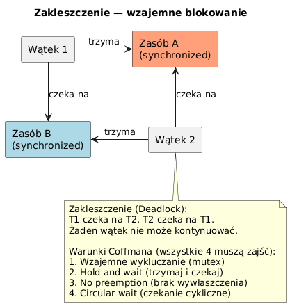

# _12_zakleszczenie - Deadlock

## Cel
Wyjasnic, czym jest zakleszczenie, jak je rozpoznac i jak mu przeciwdzialac.

## Klasyczne warunki deadlock (Coffman)
1. Wzajemne wykluczanie.
2. Hold-and-wait.
3. Brak wywlaszczenia.
4. Cykliczne oczekiwanie.

Usun przynajmniej jeden warunek, aby uniknac zakleszczenia.

## Kod
Plik: `code/DeadlockDemo.java`

Sekcje:
- `part1_Deadlock()` - celowe zakleszczenie A->B i B->A.
- `part2_FixedOrdering()` - naprawa przez stala kolejnosc przejmowania lockow.
- `part3_TryLock()` - podejscie nieblokujace i retrial.

Fragment:
```java
synchronized (RESOURCE_A) {
    synchronized (RESOURCE_B) {
        // sekcja krytyczna
    }
}
```

## Diagram


Zrodlo: `diagrams/deadlock.puml`

## Uruchomienie
```powershell
cd C:\home\gitHub\oop-concepts-java\02_OOP\src
javac -d _07_watki/out _07_watki/_12_zakleszczenie/code/DeadlockDemo.java
java -cp _07_watki/out _07_watki._12_zakleszczenie.code.DeadlockDemo
```

## Literatura
- https://en.wikipedia.org/wiki/Deadlock
- https://docs.oracle.com/en/java/javase/21/docs/api/java.base/java/util/concurrent/locks/ReentrantLock.html

