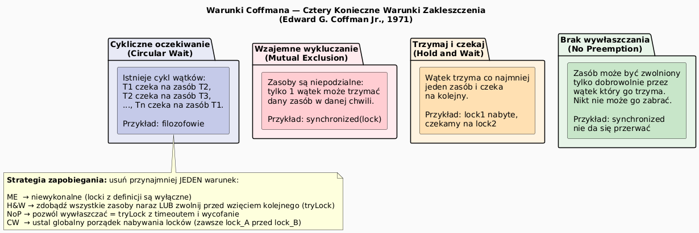

# 12 — Zakleszczenie (Deadlock)

## Cel modułu

Zrozumienie czym jest zakleszczenie, jak je rozpoznać na poziomie kodu, jak analizować za pomocą narzędzi JVM oraz jak eliminować za pomocą sprawdzonych technik.

---

## 1. Co to jest zakleszczenie?

**Zakleszczenie** (deadlock) to sytuacja, w której dwa lub więcej wątków czekają wzajemnie na zwolnienie zasobów, których żaden z nich nigdy nie zwolni — bo każdy czeka na inny. Żaden wątek nie może postąpić naprzód.

```
Wątek A trzyma lock_1, czeka na lock_2
Wątek B trzyma lock_2, czeka na lock_1
→ Obaj czekają wiecznie — DEADLOCK
```

---

## 2. Cztery warunki Coffmana



Edward G. Coffman Jr. (1971) udowodnił, że zakleszczenie wymaga **wszystkich czterech** warunków jednocześnie:

| # | Warunek | Opis |
|---|---------|------|
| 1 | **Wzajemne wykluczanie** | Zasób może być trzymany przez max 1 wątek |
| 2 | **Hold-and-wait** | Wątek trzyma zasób i czeka na kolejny |
| 3 | **Brak wywłaszczania** | Zasobu nie można zabrać siłą |
| 4 | **Cykliczne oczekiwanie** | Istnieje cykl T1→T2→...→T1 |

**Strategia:** usuń **przynajmniej jeden** z tych warunków.

---

## 3. Diagram zakleszczenia


---

## 4. Reprodukcja zakleszczenia w kodzie

```java
// Klasyczny deadlock — dwa wątki, dwa locki, odwrócona kolejność
Thread a = new Thread(() -> {
    synchronized (RESOURCE_A) {                // A bierze lock_A
        Thread.sleep(50);                      // daje czas B na lock_B
        synchronized (RESOURCE_B) {            // A czeka na lock_B ← BLOCKED
            System.out.println("A używa obu");
        }
    }
});

Thread b = new Thread(() -> {
    synchronized (RESOURCE_B) {                // B bierze lock_B
        Thread.sleep(50);
        synchronized (RESOURCE_A) {            // B czeka na lock_A ← BLOCKED
            System.out.println("B używa obu");
        }
    }
});

// Po uruchomieniu: oba wątki wiszą wiecznie
a.start(); b.start();
```

---

## 5. Naprawy

### Naprawa 1: Stały porządek blokowania (eliminuje warunek cykliczny)

```java
// ZAWSZE: lock_A przed lock_B — niezależnie od tego który wątek
synchronized (RESOURCE_A) {       // globalny porządek: A < B
    synchronized (RESOURCE_B) {
        // sekcja krytyczna
    }
}
```

Jeśli wszystkie wątki przejmują locki w tej samej kolejności (np. wg. ID zasobu, hashCode, adresu), cykl jest niemożliwy.

### Naprawa 2: `tryLock()` z timeoutem (eliminuje Hold-and-wait)

```java
ReentrantLock lockA = new ReentrantLock();
ReentrantLock lockB = new ReentrantLock();

boolean acquired = false;
while (!acquired) {
    if (lockA.tryLock(100, TimeUnit.MILLISECONDS)) {
        try {
            if (lockB.tryLock(100, TimeUnit.MILLISECONDS)) {
                try {
                    // sekcja krytyczna
                    acquired = true;
                } finally { lockB.unlock(); }
            }
        } finally { lockA.unlock(); }
    }
    if (!acquired) Thread.sleep(randomBackoff());  // unika livelock
}
```

---

## 6. Wykrywanie zakleszczenia — narzędzia JVM

```powershell
# 1. Znajdź PID procesu Java
jps

# 2. Thread dump — pokazuje BLOCKED wątki i zależności lockow
jstack <PID>

# 3. Szukaj komunikatu w dump:
# Found one Java-level deadlock:
# "Thread-0": waiting to lock monitor 0x...
#   which is held by "Thread-1"
# "Thread-1": waiting to lock monitor 0x...
#   which is held by "Thread-0"
```

Alternatywnie narzędziem JConsole (zakładka "Threads" → "Detect Deadlock").

---

## 7. Kod demonstracyjny

📄 [`code/DeadlockDemo.java`](code/DeadlockDemo.java)

Sekcje:
- `part1_Deadlock()` — celowe zakleszczenie A→B i B→A
- `part2_FixedOrdering()` — naprawa przez stały porządek lockowania
- `part3_TryLock()` — podejście nieblokujące z wycofaniem

### Uruchomienie

```powershell
cd C:\home\gitHub\oop-concepts-java\02_OOP\src
javac -d _07_watki/out _07_watki/_12_zakleszczenie/code/DeadlockDemo.java
java  -cp _07_watki/out _07_watki._12_zakleszczenie.code.DeadlockDemo
```

---

## 8. Pytania kontrolne

1. Które z czterech warunków Coffmana usuwa naprawa przez stały porządek blokowania?
2. Dlaczego `tryLock()` z timeoutem nie gwarantuje braku livelock?
3. Jak można wykryć zakleszczenie w działającym programie?
4. Dlaczego `synchronized` nie pozwala na timeout (w odróżnieniu od `ReentrantLock`)?

---

## 📚 Literatura i źródła

- [Wikipedia — Deadlock](https://en.wikipedia.org/wiki/Deadlock)
- E.G. Coffman et al., *System Deadlocks*, ACM Computing Surveys, 1971
- Brian Goetz et al., *Java Concurrency in Practice*, rozdział 10
- [Oracle API — ReentrantLock](https://docs.oracle.com/en/java/javase/21/docs/api/java.base/java/util/concurrent/locks/ReentrantLock.html)
- [Oracle Tutorial — Deadlock](https://docs.oracle.com/javase/tutorial/essential/concurrency/deadlock.html)

