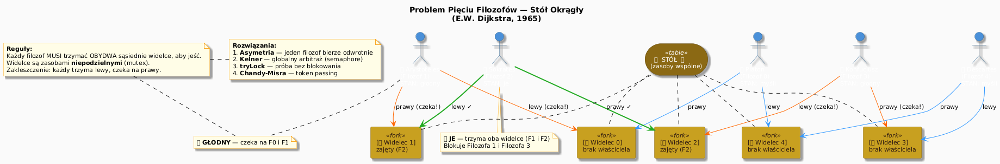
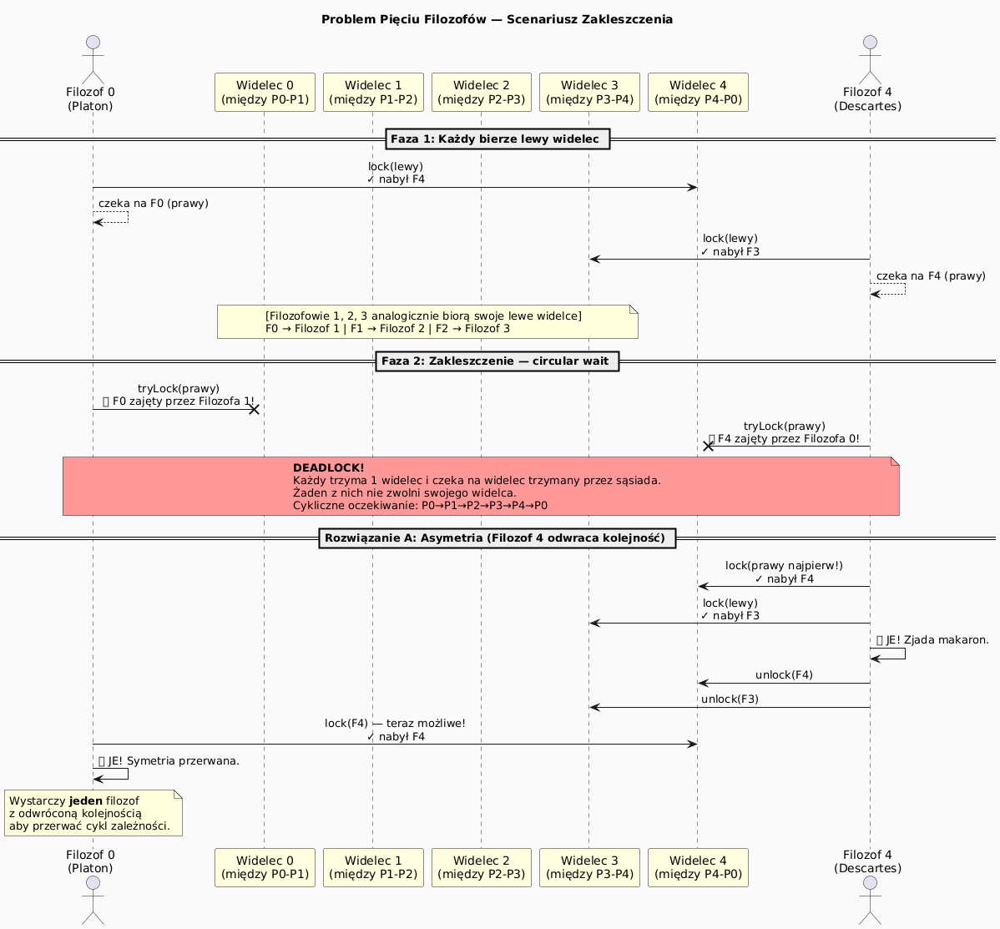
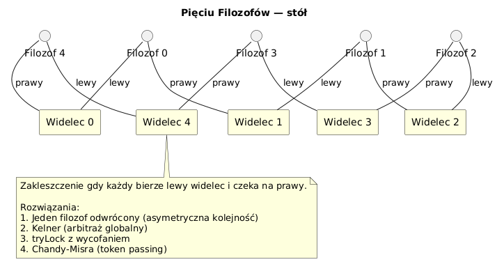

# 13 — Problem Pięciu Filozofów (Dining Philosophers)

## Cel modułu

Zrozumienie **grupowego zakleszczenia** na klasycznym, sformalizowanym przykładzie Dijkstry. Analiza czterech strategii eliminacji deadlocku i wybór odpowiedniej dla danego scenariusza.

---

## 1. Historia i kontekst

Problem Pięciu Filozofów sformułował **Edsger W. Dijkstra** w 1965 roku jako egzamin dla studentów. Upowszechnił go **Tony Hoare** w 1985 roku w książce *Communicating Sequential Processes*. Problem jest kanonicznym przykładem, bo:

- jest prosty do opisania (filozofowie, widelce, jedzenie)
- modeluje prawdziwe scenariusze (bazy danych, systemy operacyjne, sieci)
- demonstruje **wszystkie cztery warunki Coffmana** naraz
- każde z czterech rozwiązań ma inną złożoność i kompromisy

---

## 2. Opis problemu

Pięciu filozofów siedzi przy okrągłym stole. Między każdą parą sąsiadujących filozofów leży jeden widelec (łącznie 5 widelców). Każdy filozof naprzemiennie:

1. **Myśli** — nie potrzebuje zasobów (nieograniczony czas)
2. **Jest głodny** — chce jeść, więc próbuje podnieść oba widelce
3. **Je** — trzyma oba widelce; po skończeniu odkłada je i wraca do myślenia

**Ograniczenie:** Do jedzenia potrzebne są oba widelce (lewy i prawy). Widelec może trzymać tylko jeden filozof na raz.

---

## 3. Wizualizacja — Stół Okrągły



*Diagram ilustruje 5 filozofów i 5 widelców wokół stołu. Kolor połączeń wskazuje: niebieski=myśli, pomarańczowy=głodny/czeka, zielony=je.*

---

## 4. Scenariusz zakleszczenia



**Jak dochodzi do zakleszczenia (scenariusz naiwny):**

```
Krok 1: Każdy filozof podnosi LEWY widelec (udaje się — brak konfliktu)
Krok 2: Każdy próbuje podnieść PRAWY widelec
Krok 3: Każdy prawy widelec jest w rękach sąsiada → wszyscy CZEKAJĄ
Krok 4: Nikt nie odłoży swojego widelca → DEADLOCK
```

```java
// Wersja z deadlock — naiwna implementacja
void run() {
    while (true) {
        think();
        synchronized (forks[left]) {    // ← bierze lewy
            synchronized (forks[right]) { // ← czeka na prawy (który trzyma sąsiad!)
                eat();
            }
        }
    }
}
```

Deadlock jest pewny, bo spełnione są **wszystkie cztery warunki Coffmana**:
1. **Wzajemne wykluczanie** — widelec może trzymać tylko 1 filozof
2. **Hold-and-wait** — trzyma lewy, czeka na prawy
3. **Brak wywłaszczenia** — nikt nie zabierze widelca siłą
4. **Cykliczne oczekiwanie** — P0→P1→P2→P3→P4→P0

---

## 5. Diagram klasyczny (relacje widelec–filozof)



---

## 6. Rozwiązania — Cztery strategie

### Rozwiązanie 1: Asymetria kolejności (usunięcie warunku cyklicznego)

Jeden filozof (np. Filozof 4) bierze **najpierw prawy, potem lewy** widelec. To wystarczy, żeby przerwać cykl zależności.

```java
// Filozofowie 0–3: lewy → prawy
void runSymmetric(int id) {
    int left  = id;
    int right = (id + 1) % N;
    // synchronized(forks[left]) { synchronized(forks[right]) {...} }
}

// Filozof 4: prawy → lewy (odwrócony!)
void runAsymmetric() {
    int right = 0;  // co było prawym, teraz brane pierwsze
    int left  = 4;
    // synchronized(forks[right]) { synchronized(forks[left]) {...} }
}
```

**Zalety:** Prosta implementacja, brak głodzenia.
**Wady:** Wymaga globalnej wiedzy o topologii (kto jest filozofem nr 4).

---

### Rozwiązanie 2: `tryLock()` z wycofaniem (eliminacja Hold-and-wait)

Zamiast blokować na prawym widelcu (trzymając lewy), próbujemy nieblokująco. Jeśli prawego nie da się wziąć — odkładamy lewy i próbujemy ponownie.

```java
void run() throws InterruptedException {
    while (true) {
        think();
        while (true) {
            if (forks[left].tryLock()) {
                try {
                    if (forks[right].tryLock()) {
                        try { eat(); }
                        finally { forks[right].unlock(); }
                        break;  // zjadł — wychodzi z pętli
                    }
                } finally { forks[left].unlock(); }
                // losowy backoff — unika livelock!
                Thread.sleep(ThreadLocalRandom.current().nextLong(10, 50));
            }
        }
    }
}
```

**Zalety:** Brak deadlocku, nie wymaga globalnej koordynacji.
**Wady:** Możliwy **livelock** bez losowego backoffu.

---

### Rozwiązanie 3: Kelner (Semaphore globalny)

Semafor ogranicza liczbę filozofów jednocześnie próbujących podnieść widelce do `N-1`.

```java
static final Semaphore waiter = new Semaphore(4); // max 4 mogą próbować naraz

void run() throws InterruptedException {
    while (true) {
        think();
        waiter.acquire();       // "kelner daje pozwolenie"
        try {
            synchronized(forks[left]) {
                synchronized(forks[right]) { eat(); }
            }
        } finally { waiter.release(); }
    }
}
```

**Zalety:** Prosta eliminacja deadlocku przez ograniczenie konkurencji.
**Wady:** Zmniejsza stopień równoległości (nigdy wszyscy 5 jednocześnie nie je).

---

## 7. Analogie z rzeczywistości

| Problem filozofów | Rzeczywisty odpowiednik |
|-------------------|------------------------|
| Filozof | Wątek / transakcja DB |
| Widelec | Lock, plik, połączenie DB |
| Jedzenie | Sekcja krytyczna na 2+ zasobach |
| Deadlock | Zakleszczenie transakcji SQL |

Przykład SQL: Transakcja T1 blokuje tabelę `Orders`, czeka na `Customers`; T2 blokuje `Customers`, czeka na `Orders` → klasyczny deadlock.

---

## 8. Kod demonstracyjny

📄 [`code/DiningPhilosophers.java`](code/DiningPhilosophers.java)

Klasy w pliku:
- `DeadlockTable` — celowa demonstracja zakleszczenia (przerwana po timeoucie)
- `AsymmetricTable` — rozwiązanie przez asymetrię
- `TryLockTable` — rozwiązanie tryLock z backoffem
- `demonstrateDeadlock()`, `runAsymmetric()`, `runTryLock()`

### Uruchomienie

```powershell
cd C:\home\gitHub\oop-concepts-java\02_OOP\src
javac -d _07_watki/out _07_watki/_13_filozofowie/code/DiningPhilosophers.java
java  -cp _07_watki/out _07_watki._13_filozofowie.code.DiningPhilosophers
```

---

## 9. Pytania kontrolne

1. Dlaczego asymetria **jednego** filozofa wystarczy do eliminacji deadlocku?
2. Czym różni się deadlock od livelock? Jak tryLock może doprowadzić do livelock?
3. Jakie są wady rozwiązania z kelnerem (Semaphore)?
4. Które z czterech warunków Coffmana usuwa każde z rozwiązań?

---

## 📚 Literatura i źródła

- E.W. Dijkstra, *EWD310 — Hierarchical Ordering of Sequential Processes*, 1971
- Tony Hoare, *Communicating Sequential Processes*, 1985
- [Wikipedia — Dining Philosophers Problem](https://en.wikipedia.org/wiki/Dining_philosophers_problem)
- Brian Goetz et al., *Java Concurrency in Practice*, rozdział 10 — Avoiding Liveness Hazards
- [Oracle Tutorial — Deadlock](https://docs.oracle.com/javase/tutorial/essential/concurrency/deadlock.html)

