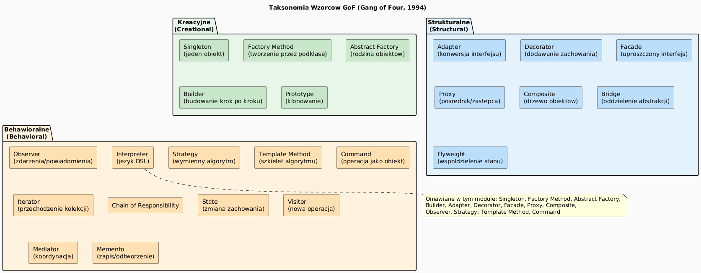

# 01 — Wprowadzenie do Wzorców Projektowych

## Cel modułu

Zrozumienie czym są wzorce projektowe, jak powstały, jak je czytać i kiedy stosować. Zapoznanie z taksonomią Gang of Four i miejscem wzorców w inżynierii oprogramowania.

---

## 1. Historia i kontekst

**Christopher Alexander** (architekt, nie informatyk!) w 1977 roku opisał ideę wzorców w budownictwie: powtarzające się problemy mają sprawdzone rozwiązania. W 1987 roku Ward Cunningham i Kent Beck zaadaptowali tę ideę do programowania obiektowego.

**Gang of Four (GoF)** — Erich Gamma, Richard Helm, Ralph Johnson, John Vlissides — w 1994 roku opublikowali *Design Patterns: Elements of Reusable Object-Oriented Software*, która opisuje 23 wzorce. Książka sprzedała się w ponad 500 000 egzemplarzy i jest jedną z najważniejszych w historii informatyki.

---

## 2. Co to jest wzorzec projektowy?

> „Wzorzec projektowy opisuje problem, który pojawia się wielokrotnie w danym środowisku, oraz podaje sprawdzone rozwiązanie tego problemu w taki sposób, aby można go było zastosować milion razy bez powtórzenia się." — Alexander, 1977

Wzorzec projektowy to:
- **Opis problemu** — kiedy ten wzorzec jest potrzebny
- **Opis rozwiązania** — jak go zaimplementować
- **Efekty** — korzyści i kompromisy

Wzorzec **nie jest** gotowym kodem do skopiowania — to schemat do adaptacji.

---

## 3. Taksonomia GoF



| Kategoria | Cel | Przykłady |
|-----------|-----|-----------|
| **Kreacyjne** | Jak tworzyć obiekty | Singleton, Factory, Builder |
| **Strukturalne** | Jak składać obiekty | Adapter, Decorator, Facade |
| **Behawioralne** | Jak obiekty współpracują | Observer, Strategy, Command |

---

## 4. Dlaczego wzorce?

### Problem 1: Eksplozja klas przez dziedziczenie

```java
// Anty-wzorzec: Pizza z wielkim konstruktorem
Pizza p = new Pizza("large", "thin", "tomato", "mozzarella", null, true, false, null, ...);
// 9 argumentów — nie wiadomo co oznacza każdy!

// Wzorzec Builder rozwiązuje:
Pizza p = new Pizza.Builder()
    .size("large").crust("thin").sauce("tomato")
    .addTopping("mozzarella").extraCheese().build();
```

### Problem 2: Zależność od konkretnej implementacji

```java
// Anty-wzorzec: twarda zależność
class OrderService {
    MySqlDatabase db = new MySqlDatabase();  // co jeśli zmienię bazę?
}

// Factory Method rozwiązuje:
Database db = DatabaseFactory.create(config.getDbType());
```

### Problem 3: Brak powiadamiania (polling)

```java
// Anty-wzorzec: aktywne odpytywanie
while (true) {
    if (stock.priceChanged()) { updateUI(); }
    Thread.sleep(1000);   // marnuje CPU!
}

// Observer rozwiązuje:
stock.addListener(event -> updateUI());  // reaguje natychmiast
```

---

## 5. Zasady, które wzorce realizują

| Zasada | Wzorce |
|--------|--------|
| **Open/Closed** | Decorator, Strategy, Command |
| **Single Responsibility** | Facade, Command |
| **Dependency Inversion** | Factory, Abstract Factory |
| **Interface Segregation** | Adapter, Proxy |
| **Liskov Substitution** | Template Method, Strategy |

---

## 6. Jak czytać opis wzorca

Każdy wzorzec GoF opisany jest przez:
1. **Nazwa** — słownik komunikacji w zespole
2. **Intencja** — jaki problem rozwiązuje
3. **Motywacja** — przykład problemu
4. **Zastosowanie** — kiedy użyć
5. **Struktura** — diagram UML
6. **Uczestnicy** — klasy i ich role
7. **Współpraca** — interakcje
8. **Efekty** — korzyści i cena
9. **Implementacja** — wskazówki
10. **Przykład kodu**
11. **Znane zastosowania**
12. **Powiązane wzorce**

---

## 7. Kod demonstracyjny

📄 [`code/PatternsIntroDemo.java`](code/PatternsIntroDemo.java)

### Uruchomienie

```powershell
cd C:\home\gitHub\oop-concepts-java\02_OOP\src
javac -d _10_wzorce/out _10_wzorce/_01_wprowadzenie/code/PatternsIntroDemo.java
java  -cp _10_wzorce/out _10_wzorce._01_wprowadzenie.code.PatternsIntroDemo
```

---

## 8. Pytania kontrolne

1. Czym różni się wzorzec projektowy od biblioteki?
2. Jakie są trzy kategorie wzorców GoF i czym się różnią?
3. Który wzorzec jest rozwiązaniem "eksplozji klas przez dziedziczenie"?
4. Dlaczego wzorce są "językiem" komunikacji w zespole?

---

## 📚 Literatura

- Erich Gamma et al., *Design Patterns: Elements of Reusable Object-Oriented Software*, 1994
- Joshua Bloch, *Effective Java*, 3rd ed., 2018
- [Refactoring.Guru — Design Patterns](https://refactoring.guru/design-patterns)
- [SourceMaking — Design Patterns](https://sourcemaking.com/design_patterns)

