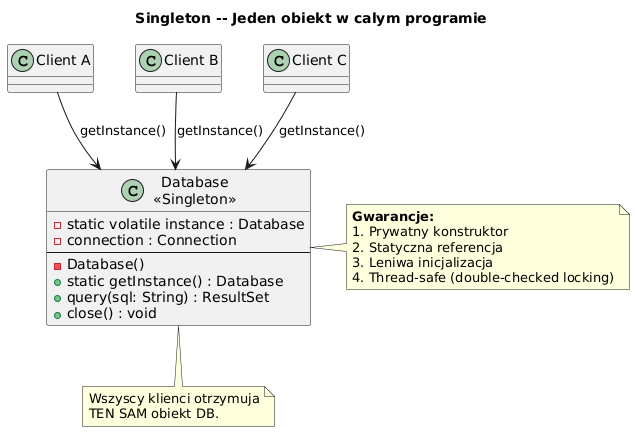

# 02 — Singleton (Kreacyjny)

## Cel

Zagwarantowanie, że klasa ma **dokładnie jeden egzemplarz** i udostępnienie do niego globalnego punktu dostępu.

---

## 1. Kiedy stosować?

- Konfiguracja aplikacji (jednorazowo ładowana)
- Pula połączeń do bazy danych (connection pool)
- Logger, metryki — jeden centralny punkt
- Rejestry (Registry) — jeden katalog obiektów

---

## 2. Diagram



---

## 3. Trzy implementacje — ewolucja

### Wariant 1: Naiwny (❌ nie thread-safe)

```java
public class Singleton {
    private static Singleton instance;

    private Singleton() {}

    public static Singleton getInstance() {
        if (instance == null) {           // RACE CONDITION!
            instance = new Singleton();   // dwa wątki mogą wejść jednocześnie
        }
        return instance;
    }
}
```

**Problem:** Przy wielowątkowości dwa wątki mogą jednocześnie przejść przez `if (instance == null)` i stworzyć dwa obiekty.

---

### Wariant 2: Double-Checked Locking (✓ thread-safe, lazy)

```java
public class Singleton {
    // volatile gwarantuje widoczność i zakaz reorderowania instrukcji
    private static volatile Singleton instance;

    private Singleton() {}

    public static Singleton getInstance() {
        if (instance == null) {                     // szybka ścieżka (bez locka)
            synchronized (Singleton.class) {
                if (instance == null) {             // pewna inicjalizacja
                    instance = new Singleton();
                }
            }
        }
        return instance;
    }
}
```

`volatile` jest konieczny, bo bez niego JIT może zreorderować kroki inicjalizacji obiektu.

---

### Wariant 3: Holder Idiom (✓ lazy, thread-safe, bez synchronized)

```java
public class Singleton {
    private Singleton() {}

    private static final class Holder {
        static final Singleton INSTANCE = new Singleton();
        // ClassLoader gwarantuje thread-safe inicjalizację klas!
    }

    public static Singleton getInstance() {
        return Holder.INSTANCE;  // leniwe — Holder ładowany dopiero tutaj
    }
}
```

---

### Wariant 4: Enum Singleton (✓ Bloch — najbezpieczniejszy)

```java
public enum AppConfig {
    INSTANCE;

    private String dbUrl = "jdbc:postgresql://localhost/mydb";

    public String getDbUrl() { return dbUrl; }
    public void setDbUrl(String url) { this.dbUrl = url; }
}

// Użycie:
AppConfig.INSTANCE.getDbUrl();
```

**Dlaczego Enum?**
- JVM gwarantuje jeden egzemplarz każdego enum
- Automatyczna ochrona przed refleksją (`java.lang.reflect.Constructor.newInstance()` rzuca `IllegalArgumentException`)
- Automatyczna ochrona przed deserializacją
- Serializacja działa poprawnie out-of-box

---

## 4. Pułapki i anty-wzorce

```java
// ❌ Singleton z mutowalnym stanem utrudnia testowanie
class Cache {  // Singleton
    private Map<String,Object> data = new HashMap<>();
    // Każdy test widzi stan z poprzedniego testu!
}

// ✓ Lepiej: wstrzyknij Cache jako zależność (DI)
class OrderService {
    private final Cache cache;  // nie singleton, wstrzyknięty!
    OrderService(Cache cache) { this.cache = cache; }
}
```

```java
// ❌ Singleton globalny zamiast DI
class Service {
    void process() {
        Database db = Database.getInstance();  // ukryta zależność!
    }
}

// ✓ Lepiej: przekaż przez konstruktor
class Service {
    Service(Database db) { this.db = db; }  // jawna zależność, testowalny
}
```

---

## 5. Kod demonstracyjny

📄 [`code/SingletonDemo.java`](code/SingletonDemo.java)

Demonstruje: naiwny, DCL, Holder, Enum + test wielowątkowy.

### Uruchomienie

```powershell
cd C:\home\gitHub\oop-concepts-java\02_OOP\src
javac -d _10_wzorce/out _10_wzorce/_02_singleton/code/SingletonDemo.java
java  -cp _10_wzorce/out _10_wzorce._02_singleton.code.SingletonDemo
```

---

## 6. Pytania kontrolne

1. Dlaczego `volatile` jest wymagany w Double-Checked Locking?
2. Jak Enum Singleton chroni przed refleksją?
3. Kiedy Singleton jest anty-wzorcem?
4. Czym Holder Idiom różni się od DCL?

---

## 📚 Literatura

- Joshua Bloch, *Effective Java*, Item 3: Enforce the singleton property with a private constructor or an enum type
- Brian Goetz, *Java Concurrency in Practice*, rozdział 16 (Java Memory Model)
- [Refactoring.Guru — Singleton](https://refactoring.guru/design-patterns/singleton)

