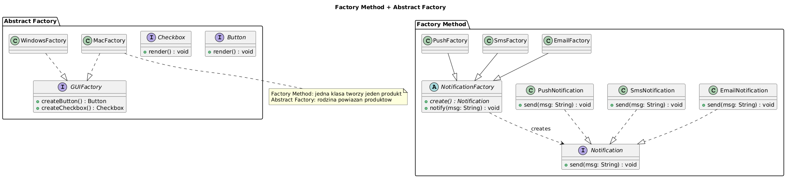

# 03 — Factory Method + Abstract Factory (Kreacyjny)

## Cel

**Factory Method:** zdefiniowanie interfejsu tworzenia obiektu, z pozostawieniem decyzji o konkretnej klasie podklasom.
**Abstract Factory:** tworzenie **rodzin** powiązanych obiektów bez specyfikowania ich konkretnych klas.

---

## 1. Diagram



---

## 2. Factory Method — kiedy?

Gdy:
- Klasa nie może z góry wiedzieć, jakie obiekty ma tworzyć
- Podklasy mają decydować o typie tworzonych obiektów
- Chcesz oddzielić tworzenie obiektów od ich użycia

```java
// Interfejs wspólny
interface Notification {
    void send(String message);
}

// Fabryka abstrakcyjna — podklasa decyduje
abstract class NotificationService {
    protected abstract Notification createNotification(String target);

    public void alert(String target, String msg) {
        createNotification(target).send(msg);  // nie zna konkretnej klasy!
    }
}

class EmailService extends NotificationService {
    @Override
    protected Notification createNotification(String email) {
        return new EmailNotification(email);  // decyzja tutaj
    }
}
```

---

## 3. Statyczna metoda fabrykująca (Static Factory Method)

Joshua Bloch (Effective Java, Item 1) preferuje to zamiast konstruktorów:

```java
// Zamiast: new BigInteger("12345")
BigInteger n = BigInteger.valueOf(12345);  // statyczna fabryka

// Zamiast: new ArrayList<>()
List<String> empty = List.of();      // fabryka — niemodyfikowalna
List<String> list  = List.copyOf(other);  // kopia

// Zalety:
// ✓ Mają znaczącą nazwę (valueOf, of, getInstance, create...)
// ✓ Nie muszą tworzyć nowego obiektu (cache!)
// ✓ Mogą zwracać podtyp
```

---

## 4. Abstract Factory — kiedy?

Gdy potrzebujesz **spójnego zestawu** produktów (np. UI wyglądający jednorodnie):

```java
interface GUIFactory {
    Button    createButton();
    Checkbox  createCheckbox();
    TextField createTextField();
}

class WindowsFactory implements GUIFactory { /* wszystkie Windows */ }
class MacFactory     implements GUIFactory { /* wszystkie Mac */ }
class DarkTheme      implements GUIFactory { /* wariant z ciemnym motywem */ }

// Klient — nie zna konkretnych klas!
void buildUI(GUIFactory factory) {
    Button btn = factory.createButton();
    Checkbox chk = factory.createCheckbox();
    btn.render();   // spójna wersja
    chk.render();   // spójna wersja
}
```

---

## 5. Porównanie

| Cecha | Factory Method | Abstract Factory |
|-------|---------------|-----------------|
| Cel | 1 produkt | Rodzina produktów |
| Mechanizm | Dziedziczenie (podklasa) | Kompozycja (obiekt fabryki) |
| Granularność | Jeden typ | Wiele powiązanych typów |
| Przykład w JDK | `Calendar.getInstance()` | `DocumentBuilderFactory` |

---

## 6. Kod demonstracyjny

📄 [`code/FactoryDemo.java`](code/FactoryDemo.java)

### Uruchomienie

```powershell
cd C:\home\gitHub\oop-concepts-java\02_OOP\src
javac -d _10_wzorce/out _10_wzorce/_03_factory/code/FactoryDemo.java
java  -cp _10_wzorce/out _10_wzorce._03_factory.code.FactoryDemo
```

---

## 7. Pytania kontrolne

1. Jaka jest różnica między Factory Method a Static Factory Method?
2. Kiedy wybrać Abstract Factory zamiast Factory Method?
3. Jak Factory Method realizuje zasadę Open/Closed?
4. Podaj 3 przykłady statycznych metod fabrykujących w JDK.

---

## 📚 Literatura

- [Refactoring.Guru — Factory Method](https://refactoring.guru/design-patterns/factory-method)
- [Refactoring.Guru — Abstract Factory](https://refactoring.guru/design-patterns/abstract-factory)
- Joshua Bloch, *Effective Java*, Item 1

