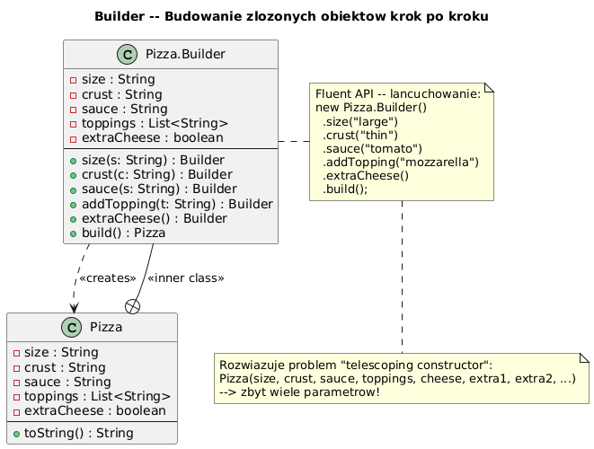

# 04 — Builder (Kreacyjny)

## Cel

Oddzielenie konstrukcji złożonego obiektu od jego reprezentacji, umożliwiając ten sam proces budowania różnych reprezentacji.

---

## 1. Problem: Teleskopujący konstruktor

```java
// ❌ Anty-wzorzec: constructor telescoping
class Pizza {
    Pizza(String size) { ... }
    Pizza(String size, String crust) { ... }
    Pizza(String size, String crust, String sauce) { ... }
    Pizza(String size, String crust, String sauce, String topping1) { ... }
    Pizza(String size, String crust, String sauce, String topping1, String topping2) { ... }
    // Exponential growth!

    // Wywołanie niejasne:
    Pizza p = new Pizza("large", "thin", "tomato", null, "mozzarella", true, false);
    //                    ^       ^       ^          ^     ^             ^     ^
    //                    ?       ?       ?          ?     ?             ?     ?
}
```

---

## 2. Diagram



---

## 3. Implementacja — Fluent Builder

```java
public final class Pizza {
    private final String size;
    private final String crust;
    private final List<String> toppings;
    private final boolean extraCheese;

    private Pizza(Builder b) {
        this.size        = b.size;
        this.crust       = b.crust;
        this.toppings    = List.copyOf(b.toppings);
        this.extraCheese = b.extraCheese;
    }

    public static final class Builder {
        private String size = "medium";     // wartości domyślne
        private String crust = "normal";
        private List<String> toppings = new ArrayList<>();
        private boolean extraCheese = false;

        // Każda metoda zwraca this — fluent API
        public Builder size(String size)          { this.size = size; return this; }
        public Builder crust(String crust)        { this.crust = crust; return this; }
        public Builder addTopping(String topping) { toppings.add(topping); return this; }
        public Builder extraCheese()              { this.extraCheese = true; return this; }

        public Pizza build() {
            if (toppings.isEmpty()) throw new IllegalStateException("Min 1 topping!");
            return new Pizza(this);
        }
    }
}

// Użycie — czytelny, samoudokumentujący się kod:
Pizza pizza = new Pizza.Builder()
        .size("large")
        .crust("thin")
        .addTopping("mozzarella")
        .addTopping("basil")
        .extraCheese()
        .build();
```

---

## 4. Builder w JDK

```java
// StringBuilder — najbardziej znany Builder
String sql = new StringBuilder()
        .append("SELECT * FROM users ")
        .append("WHERE active = true ")
        .append("ORDER BY name")
        .toString();

// ProcessBuilder — budowanie komend systemowych
Process p = new ProcessBuilder("java", "-version")
        .redirectErrorStream(true)
        .start();

// java.net.http.HttpRequest (Java 11+)
HttpRequest req = HttpRequest.newBuilder()
        .uri(URI.create("https://api.example.com/data"))
        .header("Authorization", "Bearer token123")
        .timeout(Duration.ofSeconds(30))
        .GET()
        .build();
```

---

## 5. Builder vs konstruktor z opcjami (records)

```java
// Java 16+ record — dla prostych, niemutowalnych obiektów
record Point(double x, double y, double z) {}
new Point(1.0, 2.0, 3.0);   // ok dla 2-3 pól

// Builder — gdy wiele opcjonalnych pól, walidacja, niezmienność
new Config.Builder()
    .host("localhost").port(5432).db("mydb")
    .maxPool(10).timeout(30)
    .build();   // waliduje wszystko przed stworzeniem
```

---

## 6. Kod demonstracyjny

📄 [`code/BuilderDemo.java`](code/BuilderDemo.java)

### Uruchomienie

```powershell
cd C:\home\gitHub\oop-concepts-java\02_OOP\src
javac -d _10_wzorce/out _10_wzorce/_04_builder/code/BuilderDemo.java
java  -cp _10_wzorce/out _10_wzorce._04_builder.code.BuilderDemo
```

---

## 7. Pytania kontrolne

1. Co to jest "teleskopujący konstruktor" i dlaczego jest problematyczny?
2. Dlaczego metody Buildera zwracają `this`?
3. Gdzie powinna być walidacja — w Builderze czy w konstruktorze klasy?
4. Jaka jest różnica między Builderem GoF a Builderem JDK (StringBuilder)?

---

## 📚 Literatura

- Joshua Bloch, *Effective Java*, Item 2: Consider a builder when faced with many constructor parameters
- [Refactoring.Guru — Builder](https://refactoring.guru/design-patterns/builder)

