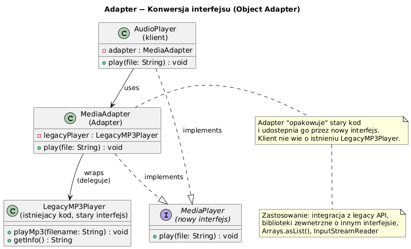

# 05 — Adapter (Strukturalny)

## Cel

Konwersja interfejsu klasy na inny interfejs, którego oczekuje klient. Adapter umożliwia współpracę klas o niekompatybilnych interfejsach.

---

## 1. Kiedy stosować?

- Chcesz użyć istniejącej klasy (legacy), ale jej interfejs nie pasuje
- Integrujesz zewnętrzną bibliotekę z różnym API
- Chcesz stworzyć wielokrotnego użytku klasę, która współpracuje z niepowiązanymi klasami

---

## 2. Diagram



---

## 3. Object Adapter (preferowany)

```java
// Stary interfejs (niedotykalny — biblioteka zewnętrzna)
class LegacyXmlParser {
    public String parseXmlToString(String xml) { ... }
    public boolean validateXml(String xml) { ... }
}

// Nowy interfejs (nasz system)
interface DataParser {
    Object parse(String data);
    boolean validate(String data);
}

// Adapter — opakowuje stary w nowy (kompozycja!)
class XmlToDataParserAdapter implements DataParser {
    private final LegacyXmlParser legacy;   // ← kompozycja, nie dziedziczenie

    XmlToDataParserAdapter(LegacyXmlParser legacy) {
        this.legacy = legacy;
    }

    @Override public Object parse(String data) {
        return legacy.parseXmlToString(data);   // translacja wywołania
    }

    @Override public boolean validate(String data) {
        return legacy.validateXml(data);
    }
}

// Klient nie wie o LegacyXmlParser — używa tylko DataParser
DataParser parser = new XmlToDataParserAdapter(new LegacyXmlParser());
parser.parse("<data>...</data>");
```

---

## 4. Adapter w JDK

```java
// Arrays.asList() — adapter tablicy do List
String[] array = {"a", "b", "c"};
List<String> list = Arrays.asList(array);  // adapter!

// InputStreamReader — adapter bajtów → znaków
InputStream is = new FileInputStream("file.txt");
Reader reader = new InputStreamReader(is, StandardCharsets.UTF_8);  // adapter!

// OutputStreamWriter — adapter Writer → OutputStream
// BufferedReader(Reader) — nie adapter, ale Decorator (patrz następny temat)
```

---

## 5. Class Adapter (dziedziczenie — Java nie preferuje)

```java
// Class Adapter (Java: ograniczone — brak wielodziedziczenia klas)
class XmlAdapterClass extends LegacyXmlParser implements DataParser {
    @Override public Object parse(String data) {
        return parseXmlToString(data);   // bezpośrednie wywołanie metody nadklasy
    }
    // Wada: dziedziczymy WSZYSTKO z LegacyXmlParser, nawet niepotrzebne metody!
}
```

---

## 6. Adapter vs Decorator vs Facade

| Wzorzec | Cel |
|---------|-----|
| **Adapter** | Zmiana interfejsu (inne API) |
| **Decorator** | Dodanie zachowania (ten sam interfejs) |
| **Facade** | Uproszczenie złożonego interfejsu |

---

## 7. Kod demonstracyjny

📄 [`code/AdapterDemo.java`](code/AdapterDemo.java)

### Uruchomienie

```powershell
cd C:\home\gitHub\oop-concepts-java\02_OOP\src
javac -d _10_wzorce/out _10_wzorce/_05_adapter/code/AdapterDemo.java
java  -cp _10_wzorce/out _10_wzorce._05_adapter.code.AdapterDemo
```

---

## 8. Pytania kontrolne

1. Jaka jest różnica między Object Adapter a Class Adapter?
2. Dlaczego Object Adapter jest preferowany w Javie?
3. Jak `Arrays.asList()` jest przykładem Adaptera?
4. Kiedy wybrać Adapter zamiast przepisania klasy?

---

## 📚 Literatura

- [Refactoring.Guru — Adapter](https://refactoring.guru/design-patterns/adapter)
- *Design Patterns: Elements of Reusable OO Software*, rozdział Adapter

