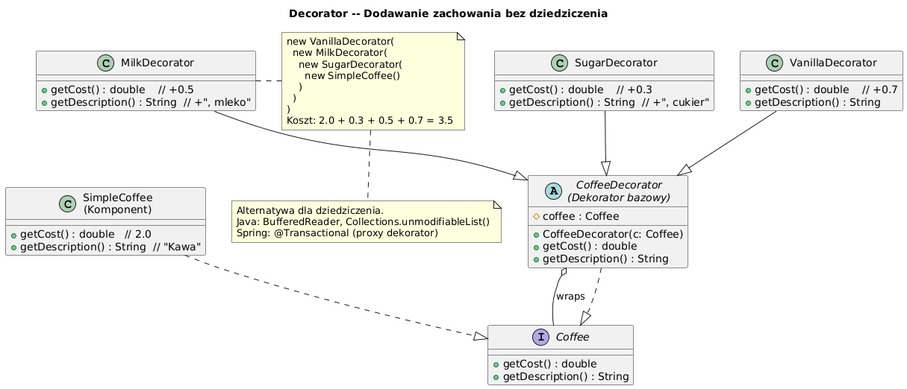

# 06 — Decorator (Strukturalny)

## Cel

Dynamiczne dodawanie nowych obowiązków do obiektu. Alternatywa dla tworzenia podklas w celu rozszerzenia funkcjonalności.

---

## 1. Problem: Eksplozja klas przez dziedziczenie

```java
// Bez Decorator: 2^N klas przy N dodatkach
class Coffee { }
class CoffeeWithMilk          extends Coffee { }
class CoffeeWithSugar         extends Coffee { }
class CoffeeWithMilkAndSugar  extends Coffee { }
class CoffeeWithVanilla       extends Coffee { }
class CoffeeWithMilkAndVanilla extends Coffee { }
// ... 2^N kombinacji dla N dodatków!

// Z Decorator: N dekoratorów, dowolna kombinacja
Coffee c = new VanillaDecorator(
               new MilkDecorator(
                   new SugarDecorator(new SimpleCoffee(), 2)));
```

---

## 2. Diagram



---

## 3. Struktura i implementacja

```java
// Komponent bazowy
interface Coffee {
    double getCost();
    String getDescription();
}

class SimpleCoffee implements Coffee {
    @Override public double getCost()        { return 2.0; }
    @Override public String getDescription() { return "Kawa"; }
}

// Bazowy dekorator — implementuje TEN SAM interfejs i zawiera komponent
abstract class CoffeeDecorator implements Coffee {
    protected final Coffee coffee;   // kompozycja!

    CoffeeDecorator(Coffee coffee) { this.coffee = coffee; }

    // Domyślnie deleguje do opakowanego obiektu
    @Override public double getCost()        { return coffee.getCost(); }
    @Override public String getDescription() { return coffee.getDescription(); }
}

// Konkretny dekorator — dodaje tylko swój koszt/opis
class MilkDecorator extends CoffeeDecorator {
    MilkDecorator(Coffee coffee) { super(coffee); }

    @Override public double getCost() {
        return super.getCost() + 0.5;   // deleguje + dodaje
    }
    @Override public String getDescription() {
        return super.getDescription() + " + Mleko";
    }
}
```

---

## 4. Decorator w JDK — strumienie I/O

```java
// Klasyczny przykład Decoratora w Javie
InputStream raw       = new FileInputStream("data.gz");
InputStream buffered  = new BufferedInputStream(raw);      // Decorator 1: buforowanie
InputStream unzipped  = new GZIPInputStream(buffered);     // Decorator 2: dekompresja
Reader reader         = new InputStreamReader(unzipped);   // Adapter!

// Odpowiednik w Coffee: new VanillaDecorator(new MilkDecorator(new SimpleCoffee()))

// Collections — Decorator
List<String> list       = new ArrayList<>(List.of("a","b","c"));
List<String> readOnly   = Collections.unmodifiableList(list);    // Decorator
List<String> synced     = Collections.synchronizedList(list);    // Decorator
```

---

## 5. Decorator vs Inheritance

| Aspekt | Dziedziczenie | Decorator |
|--------|--------------|-----------|
| Tworzenie kombinacji | Wymaga N! podklas | N dekoratorów, dowolna kombinacja |
| Kompozycja w runtime | ❌ Statyczna | ✓ Dynamiczna |
| Zasada OCP | ❌ Modyfikacja klas | ✓ Rozszerzenie bez modyfikacji |
| Przykład | extends BufferedInputStream | new BufferedInputStream(stream) |

---

## 6. Kod demonstracyjny

📄 [`code/DecoratorDemo.java`](code/DecoratorDemo.java)

### Uruchomienie

```powershell
cd C:\home\gitHub\oop-concepts-java\02_OOP\src
javac -d _10_wzorce/out _10_wzorce/_06_decorator/code/DecoratorDemo.java
java  -cp _10_wzorce/out _10_wzorce._06_decorator.code.DecoratorDemo
```

---

## 7. Pytania kontrolne

1. Dlaczego Decorator implementuje ten sam interfejs co komponent?
2. Jak Decorator różni się od dziedziczenia?
3. Jak `BufferedInputStream` jest przykładem Decoratora?
4. Ile klas potrzeba bez Decoratora dla 5 dodatków do kawy?

---

## 📚 Literatura

- [Refactoring.Guru — Decorator](https://refactoring.guru/design-patterns/decorator)
- *Head First Design Patterns*, rozdział 3 — The Decorator Pattern

