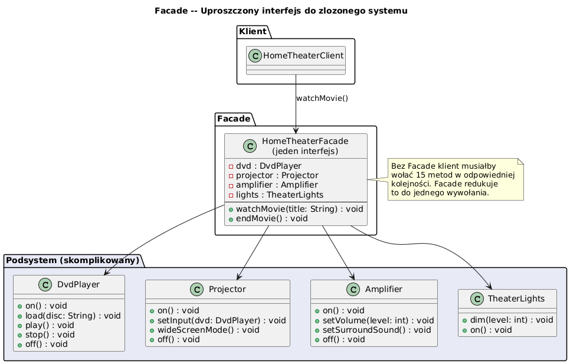

# 07 — Facade (Strukturalny)

## Cel

Zapewnienie **uproszczonego interfejsu** do złożonego podsystemu wielu klas.
Klient nie musi znać wewnętrznej struktury — wystarczy jeden obiekt fasady.

> „Fasada to recepcjonista: nie wykonuje sam wszystkich czynności, ale wie, do kogo dzwonić."

---

## 1. Problem: podsystem złożony z wielu klas

Bez fasady klient musi sam orkiestrować wiele obiektów w odpowiedniej kolejności:

```java
// ❌ Bez Facade — 15 linii, kolejność krytyczna
dvd.on();
projector.on();
projector.wideScreenMode();
projector.setInput("DVD");
amplifier.on();
amplifier.setInput("DVD");
amplifier.setSurroundSound();
amplifier.setVolume(8);
lights.dim(10);
dvd.load("Inception");
dvd.play();
```

> Jeśli dodamy nowe urządzenie — musimy zmienić **każde miejsce** w kodzie klienta.

```java
// ✓ Z Facade — 1 linia
theater.watchDvd("Inception");
```

---

## 2. Diagram



> **Kluczowe spostrzeżenie:** klient zna tylko `HomeTheaterFacade` — klasy podsystemu
> (`DvdPlayer`, `Projector`, `Amplifier`, `TheaterLights`) są przed nim ukryte.

---

## 3. Struktura wzorca

```
Client ──► Facade ──► Subsystem Class A
                 └──► Subsystem Class B
                 └──► Subsystem Class C
                 └──► ...
```

| Rola | Klasa w przykładzie | Opis |
|------|--------------------|-|
| **Facade** | `HomeTheaterFacade` | Uproszczony interfejs |
| **Subsystem** | `DvdPlayer`, `Projector`, ... | Złożona logika |
| **Client** | `main()` | Zna tylko Facade |

---

## 4. Implementacja kluczowych metod

```java
static class HomeTheaterFacade {
    private final DvdPlayer     dvd;
    private final Projector     projector;
    private final Amplifier     amplifier;
    private final TheaterLights lights;

    // Prosta metoda zamiast 10+ wywołań
    public void watchDvd(String disc) {
        lights.dim(10);
        projector.on();
        projector.wideScreenMode();
        projector.setInput("DVD");
        amplifier.on();
        amplifier.setSurroundSound();
        amplifier.setVolume(8);
        dvd.on();
        dvd.load(disc);
        dvd.play();
    }

    public void endMovie() {
        lights.brighten();
        dvd.stop();  dvd.off();
        amplifier.off();
        projector.off();
    }
}
```

> **Hook methods:** `pauseMovie()`, `setVolume()` — fasada może też udostępniać
> bardziej granularne metody, gdy klient tego potrzebuje.

---

## 5. Facade w JDK i frameworkach

| Gdzie | Facade | Podsystem |
|-------|--------|-----------|
| `javax.faces.context.FacesContext` | JSF | Servlet API, Session, ... |
| `SLF4J` Logger | SLF4J API | Logback, Log4j, java.util.logging |
| `Spring JdbcTemplate` | JDBC Facade | JDBC Connection, PreparedStatement, ResultSet |
| `java.net.URL.openStream()` | URLConnection, Stream | TCP, TLS, Proxy, Redirect |

```java
// SLF4J — Facade nad różnymi implementacjami logowania
Logger log = LoggerFactory.getLogger(MyService.class);
log.info("Zamówienie {}", orderId);   // jeden interfejs, różne backendy
```

---

## 6. Facade vs inne wzorce

| Wzorzec | Cel | Różnica |
|---------|-----|---------|
| **Facade** | Uproszczenie dostępu | Nowy interfejs, nie nowa logika |
| **Adapter** | Konwersja interfejsu | Dopasowanie istniejącego API |
| **Mediator** | Koordynacja komunikacji | Obiekty przestają komunikować się bezpośrednio |
| **Proxy** | Kontrola dostępu | Ten sam interfejs co oryginał |

> **Zasada**: Facade nie zabrania dostępu do podsystemu — zaawansowany klient
> może nadal używać klas podsystemu bezpośrednio.

---

## 7. Kiedy stosować?

✅ Gdy masz skomplikowany podsystem z wieloma klasami  
✅ Gdy chcesz odizolować warstwy aplikacji (Layered Architecture)  
✅ Gdy chcesz uprościć API biblioteki zewnętrznej  
✅ Gdy zmiany w podsystemie nie powinny wpływać na klientów

❌ Gdy Facade staje się "God Object" (robi za dużo)  
❌ Gdy wszystkie wywołania klientów i tak przechodzą przez jeden punkt

---

## 8. Kod demonstracyjny

📄 [`code/FacadeDemo.java`](code/FacadeDemo.java)

Demonstruje: kino domowe z DVD + streaming + pauza + zarządzanie głośnością.

### Uruchomienie

```powershell
cd C:\home\gitHub\oop-concepts-java\02_OOP\src
javac -d _10_wzorce/out _10_wzorce/_07_facade/code/FacadeDemo.java
java  -cp _10_wzorce/out _10_wzorce._07_facade.code.FacadeDemo
```

---

## 9. Pytania kontrolne

1. Jaka jest różnica między Facade a Adapter?
2. Czy Facade narusza zasadę Dependency Inversion? Kiedy tak, kiedy nie?
3. Czym różni się Facade od Mediatora?
4. Podaj przykład Facade w JDK lub popularnym frameworku Java.

---

## 📚 Literatura

- [Refactoring.Guru — Facade](https://refactoring.guru/design-patterns/facade)
- *Head First Design Patterns*, rozdział 7 — The Facade Pattern
- Eric Freeman et al., *Head First Design Patterns*, O'Reilly 2004

