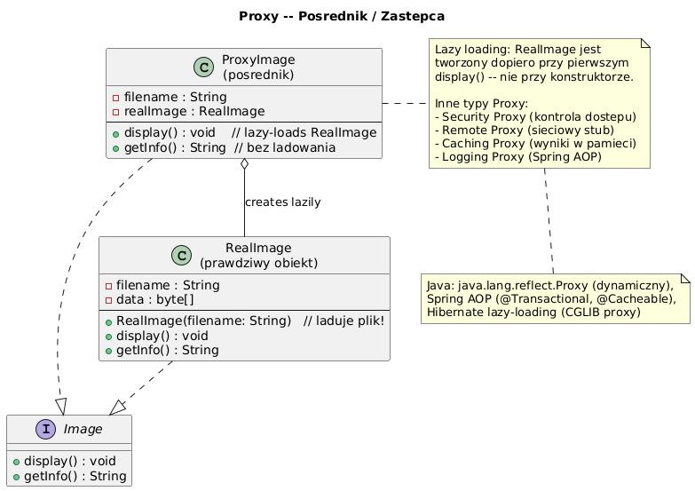

# 08 — Proxy (Strukturalny)

## Cel

Proxy dostarcza **zastępczy obiekt** kontrolujący dostęp do innego obiektu.
Klient komunikuje się z Proxy tak samo jak z oryginalnym obiektem (ten sam interfejs).

> „Proxy to agent: wygląda jak oryginał, ale przed/po wywołaniu robi coś ekstra."

---

## 1. Rodzaje Proxy

| Typ | Cel | Przykład |
|-----|-----|---------|
| **Virtual Proxy** | Leniwe tworzenie kosztownego obiektu | Ładowanie obrazu dopiero przy wyświetleniu |
| **Protection Proxy** | Kontrola uprawnień dostępu | Sprawdzenie roli użytkownika przed operacją |
| **Caching Proxy** | Zapamiętywanie wyników | Cache API, memoizacja |
| **Remote Proxy** | Lokalna reprezentacja zdalnego obiektu | RMI, gRPC stub |
| **Logging Proxy** | Transparentne logowanie wywołań | AOP w Spring |
| **Dynamic Proxy** | Generowany w runtime przez JVM | `java.lang.reflect.Proxy` |

---

## 2. Diagram



> **Kluczowe:** `Proxy` i `RealSubject` implementują ten sam interfejs.
> Klient nie wie, z którym obiektem rozmawia.

---

## 3. Virtual Proxy — lazy loading

```java
interface Image {
    void display();
    String getInfo();
}

// ✓ Tworzenie Proxy jest tanie — NIE ładuje obrazu
Image img = new LazyImageProxy("holiday-photo.jpg");

// Dopiero tutaj ładuje plik z dysku — przy PIERWSZYM użyciu
img.display();

// Kolejne wywołania — obraz już w pamięci
img.display();
```

```java
static class LazyImageProxy implements Image {
    private final String filename;
    private HighResImage realImage;   // null dopóki nie potrzebny!

    @Override
    public void display() {
        if (realImage == null) {
            realImage = new HighResImage(filename);  // kosztowna inicjalizacja
        }
        realImage.display();
    }
}
```

> **Kiedy używać:** gdy tworzenie obiektu jest drogie (I/O, DB, sieć)
> i nie zawsze jest potrzebne.

---

## 4. Protection Proxy — kontrola dostępu

```java
static class ProtectionProxy implements DocumentService {
    private final DocumentService real;
    private final Role userRole;

    @Override
    public void deleteDocument(String docId) {
        // Sprawdź uprawnienia PRZED przekazaniem do realnego obiektu
        if (userRole != Role.ADMIN) {
            throw new SecurityException("Brak uprawnień do usuwania");
        }
        real.deleteDocument(docId);  // tylko admin dociera tutaj
    }
}
```

> **Zaleta:** logika bezpieczeństwa jest w jednym miejscu (Proxy),
> a nie rozsiana po całym kodzie.

---

## 5. Caching Proxy

```java
static class CachingPriceProxy implements PriceService {
    private final PriceService real;
    private final Map<String, Double> cache = new HashMap<>();

    @Override
    public double getPrice(String productId) {
        return cache.computeIfAbsent(productId, real::getPrice);
    }
}

// Użycie:
PriceService proxy = new CachingPriceProxy(new SlowPriceService());
proxy.getPrice("A1");  // wywołanie API (100ms)
proxy.getPrice("A1");  // cache hit (0ms) — ten sam wynik!
```

---

## 6. Dynamic Proxy — Java Reflection

```java
// JVM generuje klasę Proxy w runtime!
PriceService logged = (PriceService) Proxy.newProxyInstance(
    PriceService.class.getClassLoader(),
    new Class[]{PriceService.class},
    (proxy, method, args) -> {
        System.out.println("→ " + method.getName() + Arrays.toString(args));
        Object result = method.invoke(realService, args);
        System.out.println("← " + result);
        return result;
    }
);
```

> Dynamic Proxy to fundament **Spring AOP**, **Hibernate lazy collections**,
> **Java EE interceptors** i **Mockito mock objects**.

---

## 7. Proxy w JDK i frameworkach

| Gdzie | Proxy | Co robi |
|-------|-------|---------|
| `java.lang.reflect.Proxy` | Dynamic Proxy | Generuje klasę proxy w runtime |
| Spring `@Transactional` | AOP Proxy | Dodaje transakcję przed/po metodzie |
| Spring `@Cacheable` | Caching Proxy | Cache zwracanych wartości |
| Hibernate `LazyCollection` | Virtual Proxy | Ładuje kolekcję przy pierwszym dostępie |
| Mockito | Protection/Logging Proxy | Przechwytuje wywołania do testów |

---

## 8. Proxy vs Decorator vs Adapter

| Wzorzec | Interfejs | Cel |
|---------|----------|-----|
| **Proxy** | Ten sam | Kontrola dostępu, lazy, cache, log |
| **Decorator** | Ten sam | Dodanie nowej funkcjonalności |
| **Adapter** | Nowy/inny | Konwersja interfejsu |

> **Różnica Proxy vs Decorator:** Proxy zarządza **cyklem życia** i **dostępem**
> do obiektu (może go nie mieć wcale). Decorator zawsze operuje na przekazanym obiekcie.

---

## 9. Kod demonstracyjny

📄 [`code/ProxyDemo.java`](code/ProxyDemo.java)

Demonstruje: Virtual Proxy (lazy image), Protection Proxy (GUEST/USER/ADMIN),
Caching Proxy (API calls), Dynamic Proxy (java.lang.reflect.Proxy).

### Uruchomienie

```powershell
cd C:\home\gitHub\oop-concepts-java\02_OOP\src
javac -d _10_wzorce/out _10_wzorce/_08_proxy/code/ProxyDemo.java
java  -cp _10_wzorce/out _10_wzorce._08_proxy.code.ProxyDemo
```

---

## 10. Pytania kontrolne

1. Czym Virtual Proxy różni się od Protection Proxy?
2. Jak Spring używa Dynamic Proxy do implementacji `@Transactional`?
3. Dlaczego Proxy i RealSubject muszą implementować ten sam interfejs?
4. Kiedy Proxy jest lepszy niż bezpośrednie dziedziczenie?

---

## 📚 Literatura

- [Refactoring.Guru — Proxy](https://refactoring.guru/design-patterns/proxy)
- Brian Goetz, *Java Concurrency in Practice* (Virtual Proxy w kontekście lazy init)
- [Baeldung — Dynamic Proxy](https://www.baeldung.com/java-dynamic-proxies)

