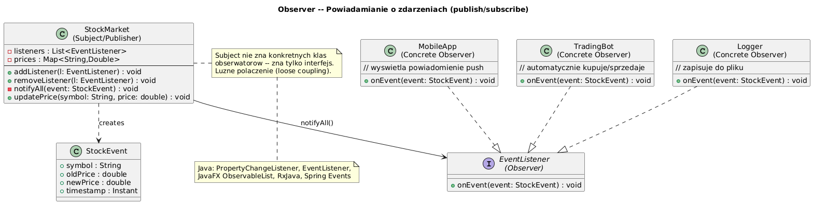

# 09 — Observer / Event (Behawioralny)

## Cel

Zdefiniowanie relacji **jeden-do-wielu**: gdy jeden obiekt (Subject) zmienia stan,
wszyscy jego obserwatorzy (Observers) są automatycznie powiadamiani i aktualizowani.

> „Subskrybujesz gazetę — gdy ukaże się nowy numer, dostajesz go automatycznie.
> Nie sprawdzasz co chwilę w kiosku, czy coś nowego jest."

---

## 1. Problem: polling vs event-driven

```java
// ❌ Polling — marnotrawstwo CPU, opóźnienie
while (true) {
    if (stock.priceChanged()) {
        updateMobileApp();
        updateTradingBot();
        updateAuditLog();
    }
    Thread.sleep(1000);  // sprawdzamy co sekundę — za wolno i za drogo!
}

// ✓ Observer — reaguje natychmiast, zero CPU przy braku zdarzeń
stock.addListener(event -> updateMobileApp(event));
stock.addListener(event -> updateTradingBot(event));
stock.addListener(event -> updateAuditLog(event));
```

---

## 2. Diagram



---

## 3. Uczestnicy wzorca

| Rola | Klasa w przykładzie | Odpowiedzialność |
|------|--------------------|-|
| **Subject (Publisher)** | `StockMarket` | Rejestruje/usuwa obserwatorów, powiadamia |
| **Observer (Listener)** | `StockListener` | Reaguje na zdarzenie |
| **ConcreteObserver** | `MobileApp`, `TradingBot`, `AuditLogger` | Konkretna reakcja |
| **Event** | `StockEvent` | Dane o zmianie (immutable record!) |

---

## 4. Implementacja Subject

```java
static class StockMarket {
    private final List<StockListener> listeners = new ArrayList<>();

    // Rejestracja
    public void addListener(StockListener l)    { listeners.add(l); }
    public void removeListener(StockListener l) { listeners.remove(l); }

    public void updatePrice(String symbol, double newPrice) {
        double oldPrice = prices.put(symbol, newPrice);
        if (Math.abs(newPrice - oldPrice) > 0.001) {
            // Powiadamiaj WSZYSTKICH obserwatorów
            for (StockListener l : listeners) {
                l.onPriceChange(new StockEvent(symbol, oldPrice, newPrice, Instant.now()));
            }
        }
    }
}
```

> **Ważne:** Subject nie zna konkretnych typów obserwatorów — tylko interfejs!
> Dodanie nowego obserwatora nie wymaga zmiany klasy Subject.

---

## 5. Observer jako interfejs funkcyjny (Java 8+)

```java
@FunctionalInterface
interface StockListener {
    void onPriceChange(StockEvent event);
}

// Lambda zamiast anonimowej klasy
market.addListener(event -> {
    if (event.changePercent() < -5.0) {
        System.out.println("ALERT CRASH: " + event.symbol());
    }
});

// Method reference
market.addListener(auditLogger::onPriceChange);
```

---

## 6. Observer w JDK i frameworkach

| Gdzie | Publisher | Observer |
|-------|---------|---------|
| `PropertyChangeSupport` | Model (JavaBean) | `PropertyChangeListener` |
| Java AWT/Swing | `Button`, `TextField` | `ActionListener`, `MouseListener` |
| Java NIO `WatchService` | Filesystem | `WatchEvent` handler |
| Reactor/RxJava | `Flux`, `Observable` | `Subscriber` |
| Spring Events | `ApplicationEventPublisher` | `@EventListener` |

```java
// Spring — Observer bez zależności od Subject
@Component
class OrderCreatedListener {
    @EventListener
    public void handle(OrderCreatedEvent event) {
        // Spring wstrzyknie zdarzenie automatycznie
        sendConfirmationEmail(event.getOrderId());
    }
}
```

---

## 7. Pułapki

```java
// ❌ Memory leak — observer nie jest usunięty!
market.addListener(new MobileApp("user123", 1.5));
// Jeśli MobileApp zostaje usunięta z UI, Subject nadal trzyma referencję

// ✓ Zawsze usuwaj observer gdy nie jest potrzebny
market.removeListener(app);

// ❌ Observer modyfikuje Subject podczas powiadamiania (ConcurrentModificationException)
@Override
public void onPriceChange(StockEvent e) {
    market.removeListener(this);  // ❌ modyfikacja listy podczas iteracji!
}

// ✓ Kopiuj listę przed iteracją
for (StockListener l : new ArrayList<>(listeners)) {
    l.onPriceChange(event);
}
```

---

## 8. Push vs Pull

| Styl | Opis | Przykład |
|------|------|---------|
| **Push** | Subject wysyła dane w zdarzeniu | `onPriceChange(StockEvent event)` — event zawiera dane |
| **Pull** | Observer sam pobiera stan | `onChanged()` — observer wywołuje `subject.getPrice()` |

> **Push** jest częstszy — mniej sprzężeń, obserwator nie potrzebuje referencji do Subject.

---

## 9. Kod demonstracyjny

📄 [`code/ObserverDemo.java`](code/ObserverDemo.java)

Demonstruje: giełda papierów wartościowych, `MobileApp`, `TradingBot`, `AuditLogger`,
lambda jako Observer, dynamic subscribe/unsubscribe.

### Uruchomienie

```powershell
cd C:\home\gitHub\oop-concepts-java\02_OOP\src
javac -d _10_wzorce/out _10_wzorce/_09_observer/code/ObserverDemo.java
java  -cp _10_wzorce/out _10_wzorce._09_observer.code.ObserverDemo
```

---

## 10. Pytania kontrolne

1. Czym Observer różni się od prostego wywołania metody?
2. Jak zapobiec memory leak w Observer?
3. Jakie są zalety Push vs Pull?
4. Jak Spring `@EventListener` implementuje wzorzec Observer?

---

## 📚 Literatura

- [Refactoring.Guru — Observer](https://refactoring.guru/design-patterns/observer)
- *Head First Design Patterns*, rozdział 2 — The Observer Pattern
- [Baeldung — Spring Events](https://www.baeldung.com/spring-events)

