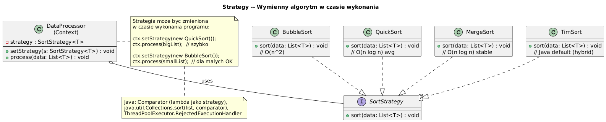

# 10 — Strategy (Behawioralny)

## Cel

Zdefiniowanie **rodziny algorytmów**, enkapsulacja każdego z nich i uczynienie ich
wymiennymi. Strategy pozwala zmieniać algorytm niezależnie od klientów, którzy go używają.

> „Nie mów mi jak to zrobić — powiedz mi CO chcesz, a ja wybiorę właściwy algorytm."

---

## 1. Problem: switch/if-else zamiast polimorfizmu

```java
// ❌ Anty-wzorzec — rozbudowany switch, naruszenie OCP
double calculateDiscount(Order order, String type) {
    return switch (type) {
        case "STUDENT"   -> order.total() * 0.10;
        case "LOYAL"     -> order.total() * 0.15;
        case "WHOLESALE" -> order.total() > 1000 ? order.total() * 0.20 : 0;
        case "NONE"      -> 0;
        default -> throw new IllegalArgumentException("Nieznany typ: " + type);
    };
    // Dodanie nowego typu = modyfikacja tej metody (naruszenie OCP!)
}

// ✓ Strategy — dodanie nowego algorytmu = nowa klasa, bez modyfikacji istniejącego
interface DiscountStrategy {
    double calculate(Order order);
}
class WholesaleDiscount implements DiscountStrategy { ... }  // nowa klasa, nie modyfikacja
```

---

## 2. Diagram



---

## 3. Struktura wzorca

| Rola | Klasa w przykładzie | Odpowiedzialność |
|------|--------------------|-|
| **Strategy** | `SortStrategy<T>` | Interfejs algorytmu |
| **ConcreteStrategy** | `BubbleSort`, `QuickSort` | Implementacja |
| **Context** | `Sorter<T>` | Używa strategii, można ją zmienić |

---

## 4. Implementacja

```java
// Interfejs strategii
interface SortStrategy<T> {
    void sort(List<T> data);
    String name();
}

// Context — używa strategii przez interfejs
class Sorter<T extends Comparable<T>> {
    private SortStrategy<T> strategy;

    Sorter(SortStrategy<T> strategy) {
        this.strategy = strategy;
    }

    // Strategia jest wymienna w runtime!
    public void setStrategy(SortStrategy<T> s) { this.strategy = s; }

    public List<T> sort(List<T> data) {
        List<T> copy = new ArrayList<>(data);
        strategy.sort(copy);   // delegacja do strategii
        return copy;
    }
}

// Użycie — zmiana algorytmu bez modyfikacji Sorter
Sorter<Integer> sorter = new Sorter<>(new BubbleSort<>());
sorter.sort(data);                          // O(n²)

sorter.setStrategy(new QuickSort<>());
sorter.sort(data);                          // O(n log n)
```

---

## 5. Strategy jako lambda (Java 8+)

W Javie 8+ każdy interfejs funkcyjny jest potencjalną strategią:

```java
// Comparator to Strategy!
List<String> names = new ArrayList<>(List.of("Charlie", "Alice", "Bob"));

names.sort(Comparator.naturalOrder());                        // strategia 1
names.sort(Comparator.comparingInt(String::length));          // strategia 2
names.sort(Comparator.reverseOrder());                        // strategia 3
names.sort(Comparator.comparingInt(String::length)
         .thenComparing(Comparator.naturalOrder()));          // złożona strategia
```

> `Comparator`, `Runnable`, `Callable`, `Predicate`, `Function` — to wszystko Strategie!

---

## 6. Strategy w JDK

| JDK API | Interfejs-Strategia | Przykłady |
|---------|--------------------|-|
| `Collections.sort()` | `Comparator` | `naturalOrder()`, `reverseOrder()` |
| `Arrays.sort()` | `Comparator` | lambdy, method references |
| `Stream.sorted()` | `Comparator` | `Comparator.comparing(...)` |
| `ThreadPoolExecutor` | `RejectedExecutionHandler` | `CallerRunsPolicy`, `AbortPolicy` |
| `LayoutManager` | `LayoutManager` | `FlowLayout`, `GridLayout` |

---

## 7. Strategy vs Template Method

| Aspekt | Strategy | Template Method |
|--------|---------|----------------|
| Mechanizm | Kompozycja (obiekt strategii) | Dziedziczenie (podklasa) |
| Zmiana algorytmu | W runtime (setStrategy) | Kompilacja (wybór podklasy) |
| Liczba klas | N strategii + 1 Context | N podklas |
| Open/Closed | ✓ — nowa strategia = nowa klasa | ✓ — nowa podklasa |

---

## 8. Kiedy stosować?

✅ Gdy masz wiele wariantów algorytmu i chcesz je wymieniać dynamicznie  
✅ Gdy chcesz uniknąć rozbudowanych switch/if-else  
✅ Gdy algorytm jest niezależny od danych, na których operuje  
✅ Gdy chcesz testować algorytmy niezależnie od kontekstu

---

## 9. Kod demonstracyjny

📄 [`code/StrategyDemo.java`](code/StrategyDemo.java)

Demonstruje: BubbleSort/InsertionSort/QuickSort, platności (CreditCard/PayPal),
Strategy jako lambda/Comparator.

### Uruchomienie

```powershell
cd C:\home\gitHub\oop-concepts-java\02_OOP\src
javac -d _10_wzorce/out _10_wzorce/_10_strategy/code/StrategyDemo.java
java  -cp _10_wzorce/out _10_wzorce._10_strategy.code.StrategyDemo
```

---

## 10. Pytania kontrolne

1. Jak Strategy realizuje zasadę Open/Closed?
2. Czym `Comparator` jest wzorcem Strategy?
3. Kiedy wybrać Strategy zamiast Template Method?
4. Jak wstrzyknąć strategię przez DI (np. Spring)?

---

## 📚 Literatura

- [Refactoring.Guru — Strategy](https://refactoring.guru/design-patterns/strategy)
- Joshua Bloch, *Effective Java*, Item 42 — Prefer lambdas to anonymous classes
- *Head First Design Patterns*, rozdział 1 — The Strategy Pattern

