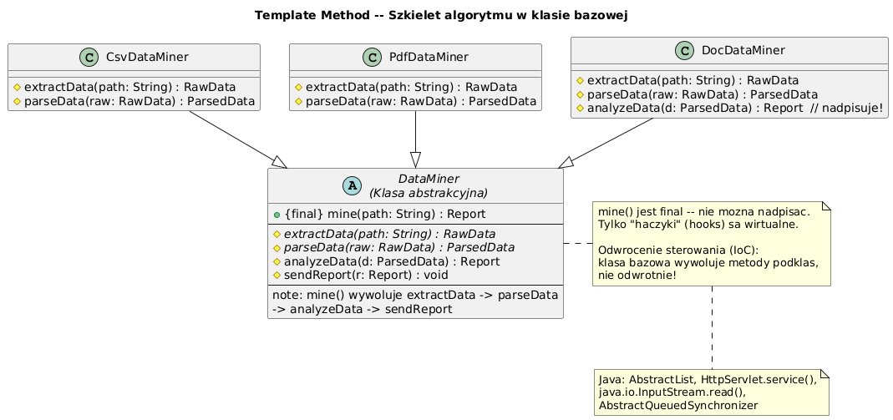

# 11 — Template Method (Behawioralny)

## Cel

Zdefiniowanie **szkieletu algorytmu** w metodzie klasy bazowej, z pozostawieniem
pewnych kroków do zaimplementowania podklasom. Template Method pozwala podklasom
redefiniować kroki bez zmiany struktury algorytmu.

> „Przepis na ciasto: namieszaj ciasto (zawsze), wypełnij nadzieniem (TY decydujesz),
> upiecz (zawsze), udekoruj (opcjonalnie)."

---

## 1. Problem: duplikacja kodu w podobnych algorytmach

```java
// ❌ Bez Template Method — identyczna struktura, różne szczegóły
class CsvExporter {
    public String export(List<Map<String,Object>> data) {
        String raw = serializeToCsv(data);       // ← różne
        String header = "# Exported\n" + raw;   // ← zawsze takie samo
        return header;
    }
}
class JsonExporter {
    public String export(List<Map<String,Object>> data) {
        String raw = serializeToJson(data);      // ← różne
        // JSON nie ma headera — zapomniałeś! błąd!
        return raw;
    }
}
// Każda zmiana w "zawsze takim samym" kodzie wymaga zmiany w N klasach
```

---

## 2. Diagram



---

## 3. Struktura wzorca

```
AbstractClass
├── templateMethod() ← FINAL — nie można nadpisać
│   ├── primitiveOp1()  ← abstract — podklasa MUSI nadpisać
│   ├── primitiveOp2()  ← abstract
│   └── hook()          ← opcjonalny, domyślna implementacja
│
ConcreteClass1 ─── implements primitiveOp1(), primitiveOp2()
ConcreteClass2 ─── implements primitiveOp1(), primitiveOp2(), hook()
```

| Element | Rola |
|---------|------|
| **Template Method** | `final` — definiuje kolejność kroków |
| **Abstract steps** | `abstract` — podklasa musi zaimplementować |
| **Hook methods** | opcjonalne — podklasa może, ale nie musi nadpisać |

---

## 4. Implementacja

```java
abstract class DataExporter {
    // Template Method — final, nie można nadpisać!
    public final String export(List<Map<String,Object>> data) {
        String raw         = serialize(data);          // abstract
        String processed   = applyTransformations(raw); // hook
        String withHeader  = addHeader(processed);     // hook
        return withHeader;
    }

    // Obowiązkowe — podklasa musi zaimplementować
    protected abstract String serialize(List<Map<String,Object>> data);
    protected abstract String getFormat();

    // Hooki — opcjonalne nadpisanie
    protected String applyTransformations(String data) {
        return data;  // domyślnie: brak transformacji
    }

    protected String addHeader(String data) {
        return "# Exported by " + getClass().getSimpleName() + "\n" + data;
    }
}

// Podklasy nadpisują tylko to, co się różni
class CsvExporter extends DataExporter {
    @Override
    protected String serialize(List<Map<String,Object>> data) {
        // ... logika CSV ...
    }
    @Override protected String getFormat() { return "CSV"; }
    // addHeader() — korzysta z domyślnej implementacji
}

class JsonExporter extends DataExporter {
    @Override
    protected String serialize(List<Map<String,Object>> data) {
        // ... logika JSON ...
    }
    @Override
    protected String addHeader(String data) {
        return data;  // JSON nie ma komentarzy — nadpisujemy hook
    }
    @Override protected String getFormat() { return "JSON"; }
}
```

---

## 5. Template Method w JDK

| Gdzie | Template Method | Hooki/kroki do nadpisania |
|-------|----------------|--------------------------|
| `AbstractList` | `iterator()`, `listIterator()` | `get(int)`, `size()` |
| `AbstractMap` | `putAll()`, `toString()` | `entrySet()` |
| `HttpServlet.service()` | `service(req, resp)` | `doGet()`, `doPost()` |
| `TimerTask.run()` | `run()` | nadpisanie całości |
| `java.io.InputStream` | `read(byte[], int, int)` | `read()` |

```java
// HttpServlet — classic Template Method
public class MyServlet extends HttpServlet {
    @Override
    protected void doGet(HttpServletRequest req, HttpServletResponse resp) {
        // Template Method wywołuje doGet po sprawdzeniu autoryzacji, CORS itp.
        resp.getWriter().write("Hello!");
    }
}
```

---

## 6. Template Method vs Strategy

| Aspekt | Template Method | Strategy |
|--------|----------------|---------|
| Mechanizm | Dziedziczenie (podklasa) | Kompozycja (obiekt) |
| Zmiana algorytmu | Kompilacja | Runtime (`setStrategy`) |
| Współdzielenie kodu | ✓ — kod w klasie bazowej | ❌ — kod w strategii |
| Testowanie | Wymaga tworzenia podklas | Łatwiejsze (wstrzyknięcie strategii) |

> **Reguła kciuka:** Template Method gdy klasy bazowa i pochodna silnie razem
> współdziałają (Inheritance). Strategy gdy algorytm powinien być niezależny.

---

## 7. Kiedy stosować?

✅ Gdy masz kilka klas z identyczną strukturą algorytmu, różnią się tylko szczegółami  
✅ Gdy chcesz kontrolować punkty rozszerzalności (tylko hooki są publiczne)  
✅ Gdy podklasy zawsze wywołują super-algorytm w tej samej kolejności

❌ Gdy potrzebujesz zmieniać algorytm w runtime → użyj Strategy  
❌ Gdy hierarchia dziedziczenia staje się zbyt głęboka

---

## 8. Kod demonstracyjny

📄 [`code/TemplateMethodDemo.java`](code/TemplateMethodDemo.java)

Demonstruje: eksport danych do CSV/JSON/HTML, walidacja z hookami,
porównanie z Template Method w JDK.

### Uruchomienie

```powershell
cd C:\home\gitHub\oop-concepts-java\02_OOP\src
javac -d _10_wzorce/out _10_wzorce/_11_template_method/code/TemplateMethodDemo.java
java  -cp _10_wzorce/out _10_wzorce._11_template_method.code.TemplateMethodDemo
```

---

## 9. Pytania kontrolne

1. Dlaczego Template Method jest oznaczana jako `final`?
2. Czym różni się abstract step od hook?
3. Jak Template Method realizuje zasadę Hollywood Principle?
4. Kiedy Template Method jest lepszy niż Strategy?

---

## 📚 Literatura

- [Refactoring.Guru — Template Method](https://refactoring.guru/design-patterns/template-method)
- *Head First Design Patterns*, rozdział 8 — The Template Method Pattern
- Joshua Bloch, *Effective Java*, Item 18 — Favor composition over inheritance

