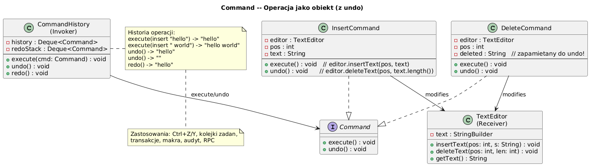

# 12 — Command (Behawioralny)

## Cel

Zamknięcie **żądania jako obiektu**, co pozwala parametryzować klientów różnymi
żądaniami, kolejkować i logować żądania oraz obsługiwać cofalne operacje (Undo/Redo).

> „Kelner zapisuje zamówienie na karteczce (Command) i przekazuje do kuchni —
> nie musi wiedzieć jak ugotować danie."

---

## 1. Problem: sprzężenie Invoker–Receiver

```java
// ❌ Bez Command — Button zna szczegóły operacji
class SaveButton {
    private final FileManager fm;
    private final Editor editor;

    public void click() {
        // Button wie za dużo! Zmiana operacji = zmiana Button
        fm.save(editor.getContent(), editor.getPath());
    }
}

// ✓ Command — Button nie zna szczegółów
class SaveButton {
    private final Command command;     // tylko interfejs!

    public void click() {
        command.execute();  // nie wie co się stanie
    }
}
```

---

## 2. Diagram



---

## 3. Uczestnicy wzorca

| Rola | Klasa w przykładzie | Odpowiedzialność |
|------|--------------------|-|
| **Command** | `Command` (interface) | `execute()` + `undo()` |
| **ConcreteCommand** | `InsertCommand`, `DeleteCommand` | Wie jak wykonać i cofnąć |
| **Receiver** | `TextEditor` | Faktycznie wykonuje pracę |
| **Invoker** | `CommandHistory` | Wywołuje `execute()`, zarządza historią |
| **Client** | `main()` | Tworzy komendy, konfiguruje Invoker |

---

## 4. Implementacja komendy z Undo

```java
interface Command {
    void execute();
    void undo();
    String describe();
}

static class InsertCommand implements Command {
    private final TextEditor editor;
    private final int pos;
    private final String text;

    @Override public void execute() { editor.insertAt(pos, text); }
    @Override public void undo()    { editor.deleteAt(pos, text.length()); }
    @Override public String describe() {
        return "INSERT(pos=" + pos + ", \"" + text + "\")";
    }
}

static class DeleteCommand implements Command {
    private String deletedText;  // ← zapamiętujemy do undo!

    @Override public void execute() {
        deletedText = editor.deleteAt(pos, len);  // zapisz przed usunięciem
    }
    @Override public void undo() {
        editor.insertAt(pos, deletedText);         // przywróć
    }
}
```

---

## 5. Invoker z historią Undo/Redo

```java
static class CommandHistory {
    private final Deque<Command> history   = new ArrayDeque<>();
    private final Deque<Command> redoStack = new ArrayDeque<>();

    public void execute(Command cmd) {
        cmd.execute();
        history.push(cmd);
        redoStack.clear();   // redo stack kasowany po nowej operacji
    }

    public void undo() {
        Command cmd = history.pop();
        cmd.undo();
        redoStack.push(cmd);
    }

    public void redo() {
        Command cmd = redoStack.pop();
        cmd.execute();
        history.push(cmd);
    }
}
```

> **Undo stos:** `Ctrl+Z` zdejmuje z `history` i wkłada do `redoStack`.
> `Ctrl+Y` zdejmuje z `redoStack` i wykonuje ponownie.

---

## 6. Makro-komenda (Composite Command)

```java
static class MacroCommand implements Command {
    private final List<Command> commands;

    @Override public void execute() {
        commands.forEach(Command::execute);
    }

    @Override public void undo() {
        // Cofnij W ODWROTNEJ KOLEJNOŚCI!
        List<Command> reversed = new ArrayList<>(commands);
        Collections.reverse(reversed);
        reversed.forEach(Command::undo);
    }
}

// Użycie:
Command formatHeading = new MacroCommand("FormatHeading",
    new InsertCommand(editor, 0, "# "),
    new InsertCommand(editor, 2, "Tytuł"),
    new InsertCommand(editor, 7, "\n")
);
history.execute(formatHeading);  // 3 operacje atomowo
history.undo();                  // cofa wszystkie 3
```

---

## 7. Command do kolejkowania i async

```java
// Command może być serializowany i wysłany przez sieć
interface Command extends Serializable {
    void execute();
}

// Kolejka zadań (Job Queue)
BlockingQueue<Command> queue = new LinkedBlockingQueue<>();
queue.put(new SendEmailCommand(email));
queue.put(new GenerateReportCommand(params));

// Worker thread
new Thread(() -> {
    while (true) {
        Command cmd = queue.take();
        cmd.execute();  // asynchronicznie
    }
}).start();

// ExecutorService — Command jako Runnable (interfejs funkcyjny!)
ExecutorService exec = Executors.newFixedThreadPool(4);
exec.submit(command::execute);
```

---

## 8. Command w JDK i frameworkach

| Gdzie | Command | Przykład |
|-------|---------|---------|
| `Runnable` | Command | `new Thread(runnable)` |
| `java.swing.Action` | Command + state | `AbstractAction` |
| `java.util.function.Consumer` | Command (bez undo) | `list.forEach(cmd::execute)` |
| Spring `@Async` | Delayed Command | metoda uruchamiana asynchronicznie |
| CQRS (Command Query) | Command/Query | `PlaceOrderCommand`, `GetOrderQuery` |

---

## 9. Kiedy stosować?

✅ Undo/Redo — operacje muszą być odwracalne  
✅ Kolejka zadań / harmonogram (scheduler)  
✅ Transakcyjność — cofnięcie zestawu operacji  
✅ Logowanie operacji (audit trail)  
✅ Parametryzacja UI (przyciski, menu) różnymi operacjami

---

## 10. Kod demonstracyjny

📄 [`code/CommandDemo.java`](code/CommandDemo.java)

Demonstruje: edytor tekstu z Insert/Delete, pełne Undo/Redo, Makro-komenda.

### Uruchomienie

```powershell
cd C:\home\gitHub\oop-concepts-java\02_OOP\src
javac -d _10_wzorce/out _10_wzorce/_12_command/code/CommandDemo.java
java  -cp _10_wzorce/out _10_wzorce._12_command.code.CommandDemo
```

---

## 11. Pytania kontrolne

1. Jak Command umożliwia implementację Undo/Redo?
2. Czemu stos Redo kasowany jest po nowej operacji?
3. Jak MacroCommand implementuje wzorzec Composite?
4. Jak `Runnable` jest wzorcem Command?

---

## 📚 Literatura

- [Refactoring.Guru — Command](https://refactoring.guru/design-patterns/command)
- *Head First Design Patterns*, rozdział 6 — The Command Pattern
- [Baeldung — Command Pattern in Java](https://www.baeldung.com/java-command-pattern)

