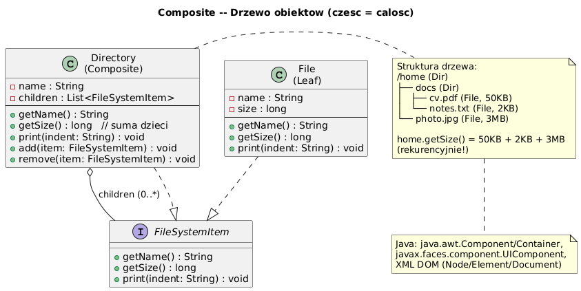

# 13 — Composite (Strukturalny)

## Cel

Kompozycja obiektów w **struktury drzewiaste** reprezentujące hierarchie całość-część.
Composite pozwala klientom traktować **pojedyncze obiekty i kompozycje jednolicie**.

> „Katalog i plik mogą być traktowane tak samo — oba mają rozmiar, nazwę, można je wydrukować."

---

## 1. Problem: różne traktowanie liści i węzłów

```java
// ❌ Bez Composite — klient musi rozróżniać typy
void printSize(Object item) {
    if (item instanceof File f) {
        System.out.println(f.getSize());
    } else if (item instanceof Directory d) {
        long total = 0;
        for (Object child : d.getChildren()) {
            total += getSize(child);  // rekurencja z if/else!
        }
        System.out.println(total);
    }
    // Co gdy dodamy SymbolicLink, Archive?
}

// ✓ Composite — jednolite traktowanie
void printSize(FileSystemItem item) {
    System.out.println(item.getSize());   // polimorfizm robi resztę!
}
```

---

## 2. Diagram



---

## 3. Struktura wzorca

```
Component (interface/abstract)
├── Leaf — nie ma dzieci, realizuje operację bezpośrednio
│   ├── FileItem
│   └── MenuItem
│
└── Composite — ma dzieci, deleguje rekurencyjnie
    ├── Directory
    └── Menu
```

| Element | Odpowiedzialność |
|---------|----------------|
| **Component** | Wspólny interfejs dla Leaf i Composite |
| **Leaf** | Nie ma dzieci — realizuje operację |
| **Composite** | Przechowuje dzieci, deleguje rekurencyjnie |

---

## 4. Implementacja: system plików

```java
interface FileSystemItem {
    String getName();
    long getSize();
    void print(String indent);
}

// Leaf — nie ma dzieci
static class FileItem implements FileSystemItem {
    private final String name;
    private final long size;

    @Override public long getSize() { return size; }  // bezpośrednia wartość

    @Override public void print(String indent) {
        System.out.printf("%s📄 %s (%,d KB)%n", indent, name, size / 1024);
    }
}

// Composite — ma dzieci
static class Directory implements FileSystemItem {
    private final List<FileSystemItem> children = new ArrayList<>();

    public void add(FileSystemItem item) { children.add(item); }

    @Override public long getSize() {
        // Rekurencja — suma rozmiarów wszystkich dzieci
        return children.stream().mapToLong(FileSystemItem::getSize).sum();
    }

    @Override public void print(String indent) {
        System.out.printf("%s📁 %s/ [%,d KB]%n", indent, name, getSize() / 1024);
        children.forEach(child -> child.print(indent + "  "));  // rekurencja!
    }
}
```

---

## 5. Kluczowa właściwość: rekurencja jest w Composite, nie w kliencie

```java
// Klient nie wie czy to plik czy katalog — ten sam kod!
home.print("");          // drukuje całe drzewo rekurencyjnie
System.out.println(home.getSize());   // suma wszystkich rozmiarów

// To samo co:
docs.print("");          // tylko poddrzewo
```

> Porównaj z przykładem bez Composite: klient musiał pisać `if (isDirectory)` wszędzie.

---

## 6. Composite w JDK i frameworkach

| Gdzie | Component | Leaf | Composite |
|-------|-----------|------|-----------|
| `java.awt.Component` | `Component` | `Button`, `Label` | `Panel`, `Frame` |
| `javax.faces.component` | `UIComponent` | `UIInput`, `UIOutput` | `UIPanel`, `UIForm` |
| `org.w3c.dom` | `Node` | `Text`, `Attr` | `Element`, `Document` |
| Spring Security | `GrantedAuthority` | `SimpleGrantedAuthority` | `RoleHierarchyImpl` |
| `java.nio.file.Path` | `Path` | plik | katalog |

---

## 7. Wzorzec Visitor na Composite

```java
// Visitor pozwala dodawać operacje na drzewie BEZ modyfikacji klas
interface FileSystemVisitor {
    void visitFile(FileItem file);
    void visitDirectory(Directory dir);
}

static class FileTypeCounter implements FileSystemVisitor {
    private final Map<String, Integer> counts = new TreeMap<>();

    @Override public void visitFile(FileItem file) {
        counts.merge(file.getType(), 1, Integer::sum);
    }
    @Override public void visitDirectory(Directory dir) { /* nic */ }
}

// Użycie
FileTypeCounter counter = new FileTypeCounter();
home.accept(counter);   // przejście drzewa
counter.printReport();  // raport typów plików
```

---

## 8. Kiedy stosować?

✅ Hierarchie obiektów (drzewo, menu, DOM, FS)  
✅ Gdy klient powinien traktować pojedyncze obiekty i grupy jednolicie  
✅ Gdy operacje na drzewie powinny być rekurencyjne bez if/else

❌ Gdy struktura nie jest hierarchiczna (nie używaj tylko dla uniformnego interfejsu)  
❌ Gdy Leaf i Composite mają bardzo różne API

---

## 9. Kod demonstracyjny

📄 [`code/CompositeDemo.java`](code/CompositeDemo.java)

Demonstruje: system plików (Leaf=FileItem, Composite=Directory),
menu hierarchiczne, Visitor na Composite.

### Uruchomienie

```powershell
cd C:\home\gitHub\oop-concepts-java\02_OOP\src
javac -d _10_wzorce/out _10_wzorce/_13_composite/code/CompositeDemo.java
java  -cp _10_wzorce/out _10_wzorce._13_composite.code.CompositeDemo
```

---

## 10. Pytania kontrolne

1. Jaka jest różnica między Leaf a Composite w tym wzorcu?
2. Dlaczego `getSize()` na Directory jest rekurencyjne?
3. Jak Visitor rozszerza Composite bez zmiany klas?
4. Podaj przykład Composite w JDK GUI.

---

## 📚 Literatura

- [Refactoring.Guru — Composite](https://refactoring.guru/design-patterns/composite)
- *Head First Design Patterns*, rozdział 9 — The Composite Pattern
- [Baeldung — Composite Pattern](https://www.baeldung.com/java-composite-pattern)

