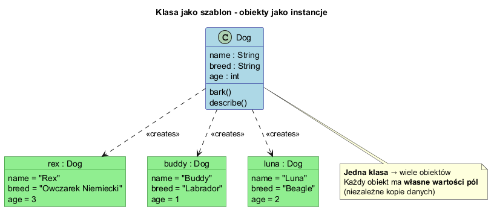
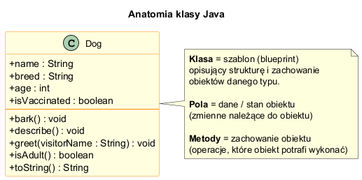
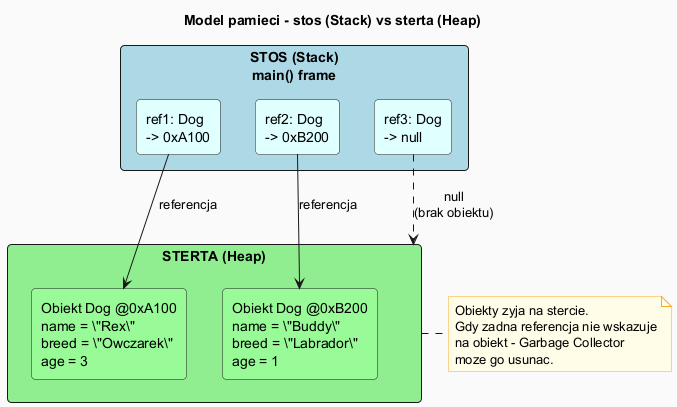

# Klasy i Obiekty w Javie

## Spis treści

1. [Czym jest klasa?](#1-czym-jest-klasa)
2. [Czym jest obiekt?](#2-czym-jest-obiekt)
3. [Pola (Fields)](#3-pola-fields)
4. [Metody (Methods)](#4-metody-methods)
5. [Tworzenie obiektów — operator `new`](#5-tworzenie-obiektów--operator-new)
6. [Referencje vs obiekty](#6-referencje-vs-obiekty)
7. [Model pamięci — stos i sterta](#7-model-pamięci--stos-i-sterta)
8. [Przykład zaawansowany — BankAccount](#8-przykład-zaawansowany--bankaccount)
9. [Uruchamianie przykładów](#9-uruchamianie-przykładów)

---

## 1. Czym jest klasa?

**Klasa** to szablon (ang. *blueprint*) opisujący:

- **strukturę** obiektów danego typu — jakie dane przechowują (pola)
- **zachowanie** obiektów — co potrafią robić (metody)

Analogia: klasa to przepis na ciasto — możemy upiec wiele ciast (obiektów) według jednego przepisu.

```java
// Definicja klasy
public class Dog {
    // pola — dane obiektu
    String name;
    String breed;
    int age;

    // metody — zachowanie obiektu
    void bark() {
        System.out.println(name + " mówi: Hau! Hau!");
    }
}
```

> 📄 Pełny kod: [`basic/Dog.java`](basic/Dog.java)

---

## 2. Czym jest obiekt?

**Obiekt** (instancja) to konkretny egzemplarz klasy, tworzony za pomocą operatora `new`.

- Każdy obiekt ma **własne wartości pól** — niezależne od innych obiektów tej samej klasy
- Obiekt **żyje na stercie** (heap)
- Do obiektu odwołujemy się przez **referencję**

```java
// Tworzenie obiektów (instancji)
Dog rex   = new Dog();   // obiekt #1
Dog buddy = new Dog();   // obiekt #2 — niezależny od #1

rex.name   = "Rex";
buddy.name = "Buddy";

System.out.println(rex.name);   // "Rex"
System.out.println(buddy.name); // "Buddy" — własna kopia pola
```

### Diagram: klasa jako szablon → wiele obiektów



> 📄 Diagram PlantUML: [`diagrams/object_vs_class.puml`](diagrams/object_vs_class.puml)

---

## 3. Pola (Fields)

**Pola** to zmienne należące do klasy lub obiektu. Definiują **stan** obiektu.

```java
public class Dog {
    String name;          // pole tekstowe
    String breed;         // pole tekstowe
    int age;              // pole liczbowe
    boolean isVaccinated; // pole logiczne
}
```

### Anatomia klasy



> 📄 Diagram PlantUML: [`diagrams/class_anatomy.puml`](diagrams/class_anatomy.puml)

### Wartości domyślne pól

Pola obiektów mają wartości domyślne jeśli nie zostaną zainicjalizowane:

| Typ          | Wartość domyślna |
|--------------|-----------------|
| `int`, `long`, `short`, `byte` | `0` |
| `double`, `float` | `0.0` |
| `boolean` | `false` |
| `char` | `'\u0000'` |
| Referencje (Object, String, ...) | `null` |

---

## 4. Metody (Methods)

**Metody** definiują **zachowanie** obiektu — operacje, które można na nim wykonać.

### Składnia metody

```
[modyfikator] typZwracany nazwaMeTody([parametry]) {
    // ciało metody
    [return wartość;]
}
```

### Rodzaje metod

```java
// 1. Metoda bez parametrów, bez wartości zwracanej
void bark() {
    System.out.println(name + " mówi: Hau!");
}

// 2. Metoda z parametrem
void greet(String visitorName) {
    System.out.println(name + " wita się z " + visitorName);
}

// 3. Metoda zwracająca wartość
boolean isAdult() {
    return age >= 2;
}

// 4. Metoda toString() — tekstowa reprezentacja obiektu
@Override
public String toString() {
    return "Dog{name='" + name + "', age=" + age + "}";
}
```

### Wywołanie metod

```java
Dog rex = new Dog();
rex.name = "Rex";
rex.age = 3;

rex.bark();                    // wywołanie — brak zwracanej wartości
rex.greet("Anna");             // wywołanie z argumentem
boolean adult = rex.isAdult(); // wywołanie pobierające wynik
System.out.println(rex);       // toString() wywołane automatycznie
```

---

## 5. Tworzenie obiektów — operator `new`

Operator `new` wykonuje kolejno:

1. **Alokuje pamięć** na stercie (heap) dla nowego obiektu
2. **Inicjalizuje pola** wartościami domyślnymi
3. **Wywołuje konstruktor** (specjalna metoda inicjalizacyjna)
4. **Zwraca referencję** do nowego obiektu

```java
//  ┌─ deklaracja zmiennej referencyjnej (stos)
//  │      ┌─ operator new — tworzy obiekt na stercie
//  │      │      ┌─ konstruktor klasy
Dog rex = new Dog();
//          └──────── referencja zapisana w zmiennej rex
```

---

## 6. Referencje vs obiekty

Zmienna obiektowa **nie przechowuje obiektu** — przechowuje **referencję** (adres) do obiektu na stercie.

```java
Dog rex = new Dog();
rex.name = "Rex";
rex.age = 4;

// Przypisanie referencji — NIE kopiuje obiektu!
Dog aliasRex = rex;   // obie zmienne wskazują na TEN SAM obiekt
aliasRex.age = 10;

System.out.println(rex.age);       // 10 — TEN SAM obiekt!
System.out.println(aliasRex.age);  // 10

// Porównanie referencji (== sprawdza czy to ten sam obiekt)
System.out.println(rex == aliasRex); // true — ten sam obiekt
System.out.println(rex == buddy);    // false — różne obiekty
```

### Null — brak obiektu

```java
Dog nodog = null;   // zmienna nie wskazuje na żaden obiekt

if (nodog != null) {
    nodog.bark();   // bezpieczne — sprawdzamy przed użyciem
}
// nodog.bark() bez sprawdzenia → NullPointerException!
```

---

## 7. Model pamięci — stos i sterta



> 📄 Diagram PlantUML: [`diagrams/memory_model.puml`](diagrams/memory_model.puml)

| Stos (Stack) | Sterta (Heap) |
|---|---|
| Zmienne lokalne i referencje | Obiekty (instancje klas) |
| Automatycznie zarządzany | Zarządzany przez Garbage Collector |
| Ograniczony rozmiar | Znacznie większy |
| Szybki dostęp | Wolniejszy dostęp |

---

## 8. Przykład zaawansowany — BankAccount

Klasa `BankAccount` demonstruje bardziej realistyczny scenariusz z **enkapsulacją** (ukrywaniem pól prywatnych).

```java
public class BankAccount {
    private String owner;         // prywatne — niedostępne z zewnątrz
    private double balance;

    public BankAccount(String owner, String accountNumber, double initialBalance) {
        this.owner = owner;
        this.balance = initialBalance;
    }

    public void deposit(double amount) {
        if (amount > 0) {
            balance += amount;
        }
    }

    public double getBalance() {  // getter — kontrolowany dostęp do odczytu
        return balance;
    }
}
```

```java
BankAccount alice = new BankAccount("Alice", "PL61...", 1000.00);
alice.deposit(500.00);
alice.withdraw(200.00);

System.out.println(alice.getBalance()); // 1300.00
// alice.balance = 9999;  // BŁĄD KOMPILACJI — pole prywatne!
```

> 📄 Pełny kod: [`advanced/BankAccount.java`](advanced/BankAccount.java)
> 📄 Demo: [`advanced/BankAccountDemo.java`](advanced/BankAccountDemo.java)

---

## 9. Uruchamianie przykładów

Kompilacja i uruchomienie z katalogu `02_OOP/src`:

```bash
# Kompilacja wszystkich klas
javac -d . introduction/classes/basic/*.java

# Uruchomienie demo podstawowego
java introduction.classes.basic.ClassesDemo
```

```bash
# Kompilacja przykładu zaawansowanego
javac -d . introduction/classes/advanced/*.java

# Uruchomienie demo zaawansowanego
java introduction.classes.advanced.BankAccountDemo
```

Możesz też użyć skryptu PowerShell:

```powershell
.\run-classes-examples.ps1
```

---

## Podsumowanie

| Pojęcie | Definicja |
|---------|-----------|
| **Klasa** | Szablon (blueprint) opisujący strukturę i zachowanie obiektów |
| **Obiekt** | Konkretna instancja klasy, tworzona przez `new` |
| **Pole** | Zmienna należąca do obiektu (stan) |
| **Metoda** | Funkcja należąca do klasy (zachowanie) |
| **Referencja** | Zmienna przechowująca adres obiektu na stercie |
| **null** | Brak obiektu (referencja do niczego) |

