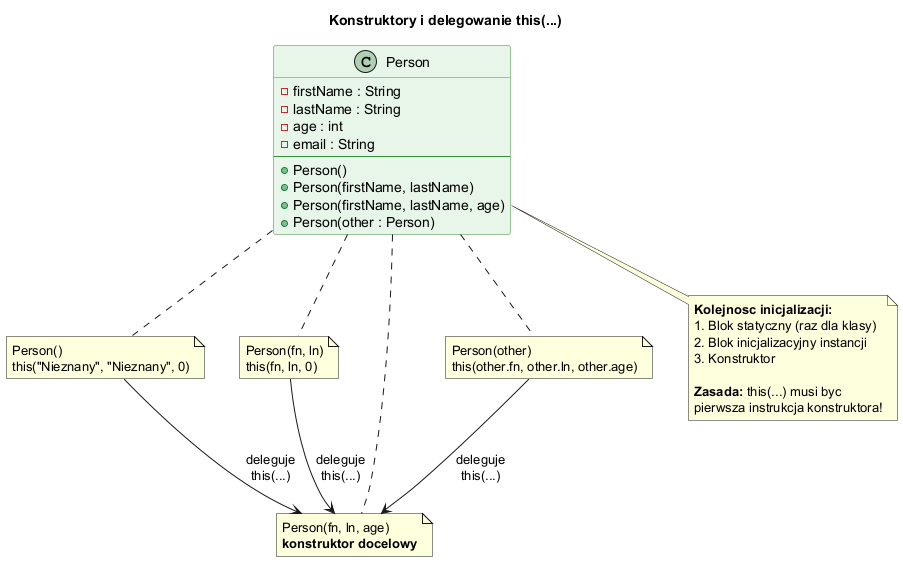
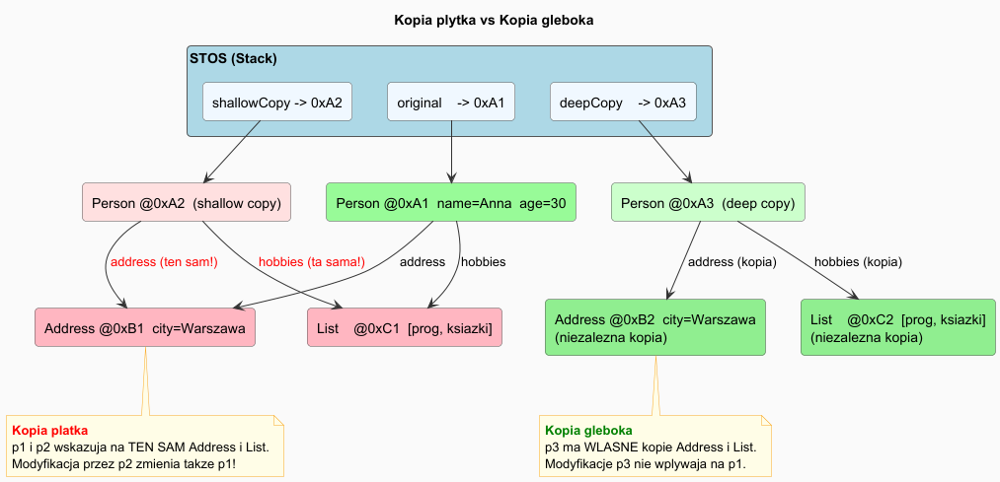
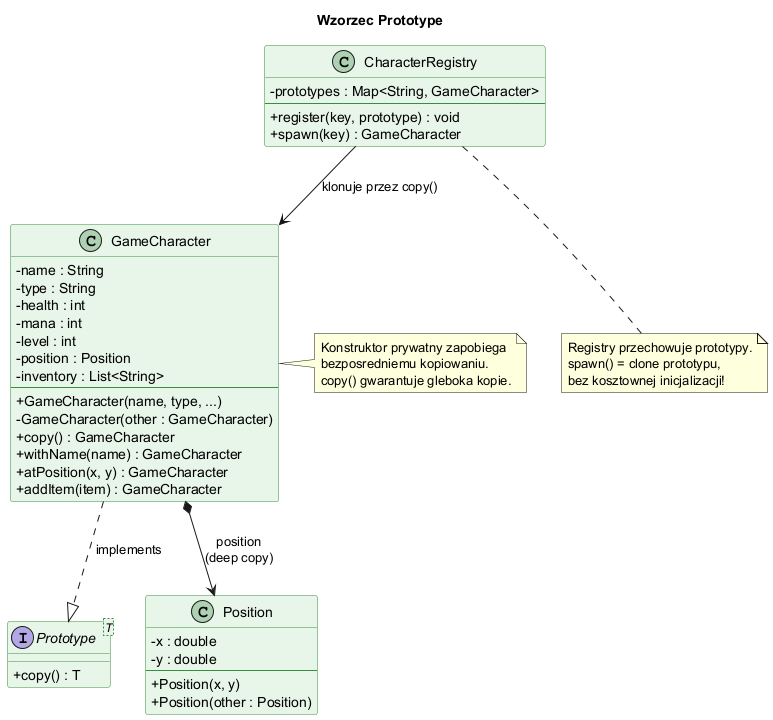
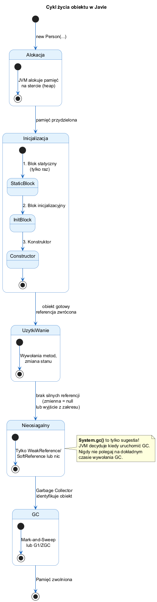
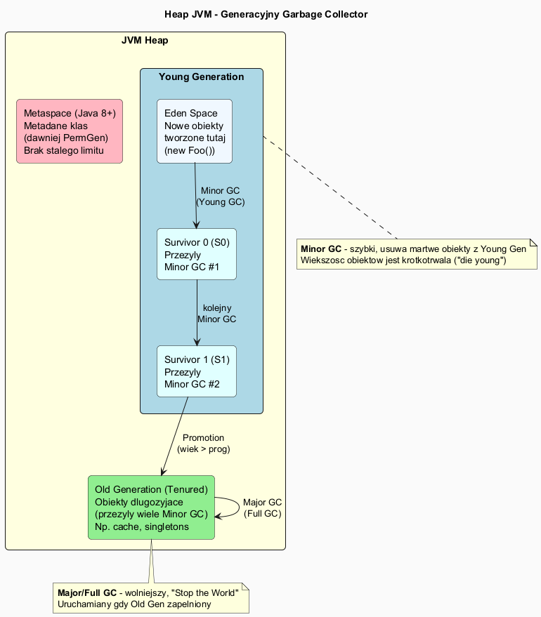

# Inicjalizacja i Usuwanie Obiektów — Konstruktory i Garbage Collector

## Spis treści

1. [Konstruktory](#1-konstruktory)
2. [Przeciążanie konstruktorów i konstruktor kopiujący](#2-przeciążanie-konstruktorów-i-konstruktor-kopiujący)
3. [Delegowanie konstruktorów — `this(...)`](#3-delegowanie-konstruktorów--this)
4. [Kopia płytka vs Kopia głęboka](#4-kopia-płytka-vs-kopia-głęboka)
5. [Wzorzec Prototype](#5-wzorzec-prototype)
6. [Bloki inicjalizacyjne](#6-bloki-inicjalizacyjne)
7. [Kolejność inicjalizacji](#7-kolejność-inicjalizacji)
8. [Garbage Collector — automatyczne usuwanie obiektów](#8-garbage-collector--automatyczne-usuwanie-obiektów)
9. [Rodzaje referencji](#9-rodzaje-referencji)
10. [AutoCloseable i try-with-resources](#10-autocloseable-i-try-with-resources)
11. [Testy jednostkowe](#11-testy-jednostkowe)
12. [Uruchamianie przykładów](#12-uruchamianie-przykładów)

---

## 1. Konstruktory

**Konstruktor** to specjalna metoda wywoływana automatycznie przez `new`. Służy do **inicjalizacji obiektu**.

Cechy konstruktora:
- Nazwa identyczna z nazwą klasy
- Brak typu zwracanego (nawet `void`)
- Może mieć dowolną liczbę parametrów
- Może być przeciążony (wiele konstruktorów)

```java
public class Person {
    private String firstName;
    private String lastName;
    private int age;

    // Konstruktor domyślny
    public Person() {
        this.firstName = "Nieznany";
        this.lastName  = "Nieznany";
        this.age = 0;
    }

    // Konstruktor z parametrami
    public Person(String firstName, String lastName, int age) {
        this.firstName = firstName;
        this.lastName  = lastName;
        this.age       = age;
    }
}
```

```java
Person p1 = new Person();                    // konstruktor domyślny
Person p2 = new Person("Anna", "Nowak", 30); // konstruktor pełny
```

> 📄 Pełny kod: [`basic/Person.java`](basic/Person.java)

---

## 2. Przeciążanie konstruktorów i konstruktor kopiujący

Java pozwala na wiele konstruktorów różniących się listą parametrów:

```java
public Person() { ... }
public Person(String firstName, String lastName) { ... }
public Person(String firstName, String lastName, int age) { ... }
public Person(Person other) { ... }  // konstruktor kopiujący
```

**Konstruktor kopiujący** — tworzy nowy obiekt jako kopię istniejącego:

```java
public Person(Person other) {
    this.firstName = other.firstName;
    this.lastName  = other.lastName;
    this.age       = other.age;
    this.email     = other.email;
}
```

```java
Person original = new Person("Jan", "Kowalski", 40);
Person kopia    = new Person(original); // niezależna kopia
kopia.setAge(25);
System.out.println(original.getAge()); // 40 — niezmienione
```

> ⚠️ Uwaga: konstruktor kopiujący jest **kopią płytką** jeśli klasa zawiera
> mutowalne pola zagnieżdżone (List, Map, inne obiekty). Patrz sekcja 4.

---

## 3. Delegowanie konstruktorów — `this(...)`

Jeden konstruktor może wywołać inny za pomocą `this(...)`. Musi być **pierwszą instrukcją**.

```java
// Konstruktor 2-arg deleguje do 3-arg
public Person(String firstName, String lastName) {
    this(firstName, lastName, 0); // ← musi być PIERWSZY!
}

// Konstruktor docelowy (pełny)
public Person(String firstName, String lastName, int age) {
    this.firstName = firstName;
    this.lastName  = lastName;
    this.age       = age;
}
```

### Diagram konstruktorów



> 📄 Diagram PlantUML: [`diagrams/constructors.puml`](diagrams/constructors.puml)

---

## 4. Kopia płytka vs Kopia głęboka

Konstruktor kopiujący tworzy nowy obiekt — ale jak głęboko kopiuje?

### Problem — obiekty zagnieżdżone

```java
class Address {
    String street;
    String city;
}

class Person {
    String name;          // String jest immutable — zawsze "bezpieczny"
    int age;              // prymityw — kopiowany przez wartość
    Address address;      // mutowalny obiekt — UWAGA!
    List<String> hobbies; // mutowalna kolekcja — UWAGA!
}
```

### Kopia płytka (Shallow Copy)

Kopiuje referencje do zagnieżdżonych obiektów. Oba obiekty **dzielą** te same wewnętrzne obiekty.

```java
Person shallowCopy() {
    return new Person(this.name, this.age,
        this.address,   // ta sama referencja!
        this.hobbies);  // ta sama lista!
}
```

```java
Person p1 = new Person("Anna", 30, addr, hobbies);
Person p2 = p1.shallowCopy();

p2.address.city = "Krakow"; // ZMIENIA ORYGINAŁ!
p2.hobbies.add("sport");    // ZMIENIA ORYGINALNĄ LISTĘ!

System.out.println(p1.address.city); // "Krakow" — zmodyfikowane!
```

### Kopia głęboka (Deep Copy)

Tworzy nowe kopie wszystkich mutowalnych obiektów zagnieżdżonych.

```java
Person deepCopy() {
    return new Person(
        this.name,
        this.age,
        new Address(this.address),       // nowy obiekt Address
        new ArrayList<>(this.hobbies));  // nowa lista
}
```

```java
Person p1 = new Person("Anna", 30, addr, hobbies);
Person p2 = p1.deepCopy();

p2.address.city = "Krakow"; // p1.address.city NIEZMIENIONE
p2.hobbies.add("sport");    // p1.hobbies NIEZMIENIONA

System.out.println(p1.address.city); // "Gdansk" — niezmienione!
```

### Diagram



> 📄 Diagram PlantUML: [`diagrams/shallow_vs_deep.puml`](diagrams/shallow_vs_deep.puml)
> 📄 Pełny kod: [`copies/CopyDemo.java`](copies/CopyDemo.java)

### Kiedy co stosować?

| Sytuacja | Podejście |
|----------|-----------|
| Tylko prymitywy i Stringi | Kopia płytka wystarczy |
| Mutowalne pola zagnieżdżone (List, Map, własne obiekty) | Kopia głęboka |
| Zagnieżdżone obiekty są `record` lub `String` (immutable) | Kopia płytka wystarczy |
| Głęboka hierarchia zagnieżdżeń | Serializacja lub biblioteka (Jackson, Kryo) |

---

## 5. Wzorzec Prototype

**Prototype** to wzorzec kreacyjny — tworzy nowe obiekty przez **klonowanie** istniejącego "prototypu" zamiast przez kosztowny konstruktor.

### Kiedy stosować?

- Tworzenie obiektu jest **kosztowne** (połączenie z DB, długa inicjalizacja)
- Chcemy tworzyć **wariacje** obiektu na bazie szablonu
- Potrzebujemy **polimorficznego klonowania** (klonowanie przez interfejs)

### Implementacja

```java
// Interfejs Prototype
interface Prototype<T> {
    T copy(); // głęboka kopia
}

class GameCharacter implements Prototype<GameCharacter> {
    private String name;
    private Position position;        // mutowalny — wymaga deep copy
    private List<String> inventory;   // mutowalny — wymaga deep copy

    // Prywatny konstruktor kopiujący — używany tylko przez copy()
    private GameCharacter(GameCharacter other) {
        this.name      = other.name;
        this.position  = new Position(other.position);     // deep copy
        this.inventory = new ArrayList<>(other.inventory); // deep copy
    }

    @Override
    public GameCharacter copy() {
        return new GameCharacter(this);
    }

    // Fluent settery — do modyfikacji klonu
    public GameCharacter withName(String name) { this.name = name; return this; }
}
```

### Rejestr prototypów

```java
class CharacterRegistry {
    private Map<String, GameCharacter> prototypes = new HashMap<>();

    void register(String key, GameCharacter proto) {
        prototypes.put(key, proto);
    }

    GameCharacter spawn(String key) {
        return prototypes.get(key).copy(); // klonowanie, nie new!
    }
}
```

```java
// Kosztowna inicjalizacja — tylko RAZ
GameCharacter warriorProto = new GameCharacter("Warrior_PROTO", ...);
registry.register("warrior", warriorProto);

// Szybkie klonowanie bez inicjalizacji
GameCharacter w1 = registry.spawn("warrior").withName("Aragorn");
GameCharacter w2 = registry.spawn("warrior").withName("Boromir");

// Prototyp niezmieniony!
System.out.println(warriorProto.getName()); // "Warrior_PROTO"
```

### Diagram



> 📄 Diagram PlantUML: [`diagrams/prototype_pattern.puml`](diagrams/prototype_pattern.puml)
> 📄 Pełny kod: [`copies/PrototypeDemo.java`](copies/PrototypeDemo.java)

---

## 6. Bloki inicjalizacyjne

### Blok inicjalizacyjny instancji

Wykonywany **przy każdym tworzeniu obiektu**, przed konstruktorem:

```java
public class Person {
    private String email;

    // Blok inicjalizacyjny — przed każdym konstruktorem
    {
        System.out.println("[INIT BLOCK] przed konstruktorem");
        email = "brak@email.com"; // wspólna inicjalizacja dla wszystkich konstruktorów
    }

    public Person() { System.out.println("[CONSTRUCTOR] domyślny"); }
    public Person(String firstName, String lastName, int age) {
        System.out.println("[CONSTRUCTOR] pełny");
    }
}
```

### Blok statyczny

Wykonywany **raz** — gdy klasa jest ładowana przez JVM:

```java
public class Person {
    static {
        System.out.println("[STATIC BLOCK] raz dla klasy");
        // Inicjalizacja zasobów statycznych, konfiguracja, logowanie
    }
}
```

---

## 7. Kolejność inicjalizacji

```
Pierwsze użycie klasy:
  1. Blok statyczny (tylko RAZ dla całej klasy)

Przy każdym new:
  2. Blok inicjalizacyjny instancji
  3. Konstruktor
```

Przykład — uruchomienie `new Person()` po raz pierwszy:

```
[STATIC BLOCK] Klasa Person załadowana przez JVM     ← raz
[INIT BLOCK]   Blok inicjalizacyjny — przed konstruktorem
[CONSTRUCTOR]  Person(firstName, lastName, age) — docelowy
[CONSTRUCTOR]  Person() — domyślny (wywołał this(...))
```

Diagram cyklu życia obiektu:



> 📄 Diagram PlantUML: [`diagrams/object_lifecycle.puml`](diagrams/object_lifecycle.puml)

---

## 8. Garbage Collector — automatyczne usuwanie obiektów

Java zarządza pamięcią **automatycznie** przez mechanizm Garbage Collector (GC).

### Zasada osiągalności

Obiekt jest **osiągalny** (ang. *reachable*) jeśli istnieje do niego łańcuch silnych referencji z korzenia (np. ze stosu, pól statycznych).

Gdy obiekt jest **nieosiągalny** — GC może go usunąć.

```java
Person p = new Person("Anna", "Nowak", 30);
// Obiekt jest osiągalny przez zmienną p

p = null;
// Brak referencji → obiekt kandydatem do GC
// System.gc() — sugestia, nie gwarancja!
```

### Generacyjny GC — model pamięci



> 📄 Diagram PlantUML: [`diagrams/gc_generations.puml`](diagrams/gc_generations.puml)

| Obszar | Opis | GC |
|--------|------|----|
| **Eden** | Nowe obiekty | Minor GC (szybki) |
| **Survivor S0/S1** | Przeżyłe Minor GC | Minor GC |
| **Old Gen** | Długożyjące obiekty | Major/Full GC (wolny) |
| **Metaspace** | Metadane klas | Full GC |

### Dostępne GC w Java 21

| Kolektor | Uruchomienie | Charakterystyka |
|----------|-------------|-----------------|
| G1GC (domyślny) | `java App` | Balans throughput/latency |
| ZGC | `-XX:+UseZGC` | Ultra-niskie opóźnienia |
| Shenandoah | `-XX:+UseShenandoahGC` | Concurrent, niskie pause |
| Serial | `-XX:+UseSerialGC` | Jednowątkowy, minimalny overhead |

---

## 9. Rodzaje referencji

```java
import java.lang.ref.*;

// Silna (Strong) — standardowe przypisanie, GC NIE usunie
Person strong = new Person("Anna", "Nowak", 30);

// Słaba (Weak) — GC może usunąć w dowolnym momencie
WeakReference<Person> weak = new WeakReference<>(new Person("X", "Y", 0));
Person obj = weak.get(); // może zwrócić null po GC!

// Miękka (Soft) — GC usuwa tylko gdy brakuje pamięci (cache)
SoftReference<Person> soft = new SoftReference<>(new Person("Z", "W", 0));

// Fantomowa (Phantom) — po finalizacji, przed zwolnieniem pamięci
// Używana do śledzenia kiedy obiekt jest zbierany przez GC
```

> 📄 Demo GC: [`advanced/GcDemo.java`](advanced/GcDemo.java)

---

## 10. AutoCloseable i try-with-resources

Zamiast przestarzałego `finalize()` (usuniętego w Java 18) używaj `AutoCloseable`:

```java
public class ResourceHolder implements AutoCloseable {

    public ResourceHolder(String name) {
        System.out.println("[OPEN]  " + name);
    }

    @Override
    public void close() {
        System.out.println("[CLOSE] zasób zwolniony automatycznie");
    }
}
```

```java
// try-with-resources — close() wywołane automatycznie!
try (ResourceHolder res = new ResourceHolder("Plik")) {
    res.doWork();
} // ← res.close() tutaj, nawet gdy rzucony wyjątek

// Wiele zasobów — zamykane w odwrotnej kolejności otwarcia
try (ResourceHolder r1 = new ResourceHolder("Socket");
     ResourceHolder r2 = new ResourceHolder("Plik")) {
    r1.doWork();
    r2.doWork();
} // r2.close(), potem r1.close()
```

> 📄 Pełny kod: [`advanced/ResourceHolder.java`](advanced/ResourceHolder.java)

---

## 11. Testy jednostkowe

Testy weryfikują konstruktory, walidację i zachowanie kopii:

```java
// Test konstruktora kopiującego — niezależność
@Test
void copyConstructorCreatesIndependentCopy() {
    Person original = new Person("Anna", "Kowalska", 30);
    Person copy = new Person(original);

    copy.setAge(25);

    assertEquals(30, original.getAge(), "Oryginal nie powinien sie zmienic");
    assertEquals(25, copy.getAge());
    assertNotSame(original, copy);
}

// Test głębokiej kopii — zmiana przez kopię nie wpływa na oryginał
@Test
void deepCopyMutationDoesNotAffectOriginal() {
    Address addr    = new Address("Ul. C", "Wroclaw");
    PersonDeep orig = new PersonDeep("Piotr", 40, addr, new ArrayList<>());
    PersonDeep copy = orig.deepCopy();

    copy.address.city = "Lublin";

    assertEquals("Wroclaw", orig.address.city); // niezmienione!
}

// Test płytkiej kopii — współdzielenie referencji
@Test
void shallowCopySharesAddressReference() {
    PersonShallow orig = new PersonShallow("Anna", 30, addr, hobbies);
    PersonShallow copy = orig.shallowCopy();

    assertSame(orig.address, copy.address); // ten sam obiekt!
}
```

> 📄 Testy Person: [`tests/PersonTest.java`](tests/PersonTest.java)
> 📄 Testy kopii: [`tests/CopyTest.java`](tests/CopyTest.java)

---

## 12. Uruchamianie przykładów

```bash
# Z katalogu 02_OOP/src

# Konstruktory i inicjalizacja
javac -d . introduction/object_lifecycle/basic/*.java
java introduction.object_lifecycle.basic.PersonDemo

# Kopie płytkie i głębokie
javac -d . introduction/object_lifecycle/copies/CopyDemo.java
java introduction.object_lifecycle.copies.CopyDemo

# Wzorzec Prototype
javac -d . introduction/object_lifecycle/copies/PrototypeDemo.java
java introduction.object_lifecycle.copies.PrototypeDemo

# Garbage Collector
javac -d . introduction/object_lifecycle/advanced/GcDemo.java
java introduction.object_lifecycle.advanced.GcDemo

# AutoCloseable / try-with-resources
javac -d . introduction/object_lifecycle/advanced/ResourceHolder.java
java introduction.object_lifecycle.advanced.ResourceHolder
```

```powershell
.\run-lifecycle-examples.ps1
```

---

## Podsumowanie

| Pojęcie | Opis |
|---------|------|
| **Konstruktor** | Specjalna metoda inicjalizująca obiekt, wywołana przez `new` |
| **Przeciążanie konstruktorów** | Wiele konstruktorów z różnymi parametrami |
| **`this(...)`** | Wywołanie innego konstruktora z konstruktora |
| **Konstruktor kopiujący** | Tworzy nowy obiekt jako kopię istniejącego |
| **Kopia płytka** | Kopiuje referencje — zagnieżdżone obiekty współdzielone |
| **Kopia głęboka** | Kopiuje wszystkie obiekty — pełna niezależność |
| **Wzorzec Prototype** | Klonowanie zamiast `new` — dla kosztownej inicjalizacji |
| **Blok statyczny** | Wykonywany raz przy ładowaniu klasy |
| **Blok inicjalizacyjny** | Wykonywany przed każdym konstruktorem |
| **GC** | Automatyczne usuwanie nieosiągalnych obiektów |
| **`AutoCloseable`** | Nowoczesny sposób zwalniania zasobów |
| **`try-with-resources`** | Gwarantuje wywołanie `close()` |

